# CHƯƠNG 2. PHÂN TÍCH THIẾT KẾ HỆ THỐNG QUẢN LÝ VẬT TƯ

## 2.1 Phân tích yêu cầu và xác định các tác nhân
### 2.1.1. Phân tích yêu cầu của hệ thống
Hệ thống quản lý vật tư được thiết kế dựa trên quy trình tương tác nội bộ giữa các cấp quản lý và nhân viên kho, nhằm tự động hóa các nghiệp vụ từ khi nhập hàng, lưu kho đến khi cấp phát vật tư cho các dự án.

| Sprint | Nội dung | Mục đích |
|---|---|---|
| 1 | Quản lý Kho, Danh mục & Vật tư | Cho phép phân loại và quản lý chi tiết từng vật tư (tên, đơn vị tính, mức tồn kho tối thiểu). Giúp thủ kho dễ dàng nắm bắt số lượng hàng trong kho. |
| 2 | Quản lý Nhà cung cấp & Dự án | Hỗ trợ lưu trữ hồ sơ các đơn vị cung cấp vật tư và danh sách các phòng ban/dự án đang có nhu cầu sử dụng vật tư. |
| 3 | Quản lý Nhập kho | Nhân viên lập phiếu nhập kho khi có hàng về, Admin duyệt để hệ thống tự động cộng dồn số lượng tồn kho. |
| 4 | Quản lý Xuất & Chuyển kho | Nhân viên lập phiếu xuất vật tư cho dự án hoặc chuyển hàng giữa các kho. Hệ thống tự động trừ tồn kho sau khi được phê duyệt. |
| 5 | Quản lý Kiểm kê kho | Hỗ trợ lập phiếu kiểm kê định kỳ để đối chiếu số lượng thực tế tại kho so với số liệu lưu trên hệ thống phần mềm. |
| 6 | Cảnh báo tồn kho & Báo cáo | Tự động cảnh báo khi vật tư rơi xuống dưới mức tối thiểu. Cung cấp báo cáo thống kê chi tiết nhập xuất tồn và xuất ra file Excel/PDF. |
| 7 | Quản lý Tài khoản & Phân quyền | Hệ thống đảm bảo tính bảo mật với cơ chế phân quyền chặt chẽ: Admin tổng, Admin kho và Nhân viên kho. |

### 2.1.2. Xác định các tác nhân
Hệ thống tập trung vào 3 tác nhân tương tác chính với các quyền hạn và nhiệm vụ cụ thể như sau:
- **Admin tổng (Quản trị viên cấp cao):** Quản lý toàn bộ người dùng, cấp quyền, quản lý mạng lưới các chi nhánh kho, phê duyệt giao dịch.
- **Admin kho (Quản lý tại kho):** Quản lý danh mục, vật tư, nhà cung cấp, dự án. Phê duyệt các phiếu nhập/xuất kho.
- **Nhân viên kho:** Tra cứu vật tư, trực tiếp lập các phiếu giao dịch (chờ duyệt) và xuất báo cáo.

**Biểu đồ Use Case tổng quan hệ thống:**
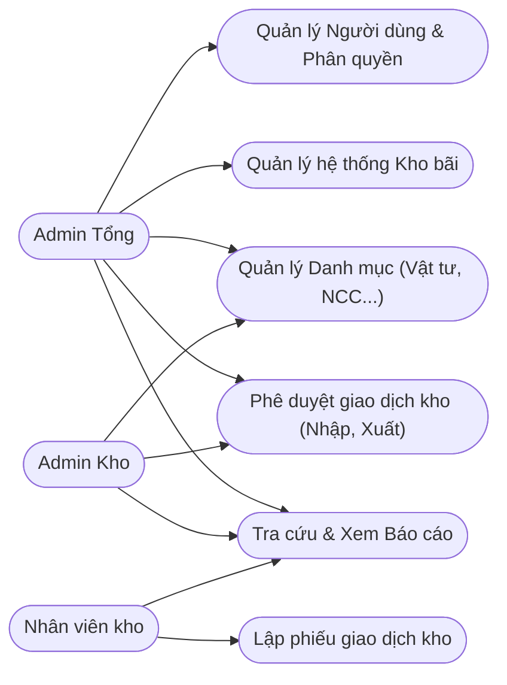

---

## 2.2. Module Quản lý Đơn vị tính và Nhà cung cấp
### 2.2.1. Giới thiệu chức năng
Chức năng này được thiết kế nhằm hỗ trợ chuẩn hóa dữ liệu đầu vào. Đơn vị tính (Cái, Chiếc, Kg, Mét...) giúp thống nhất quy cách tính toán. Nhà cung cấp giúp doanh nghiệp lưu trữ thông tin các đối tác để lập phiếu nhập hàng.

**Biểu đồ Use Case Quản lý Đơn vị tính & Nhà cung cấp:**
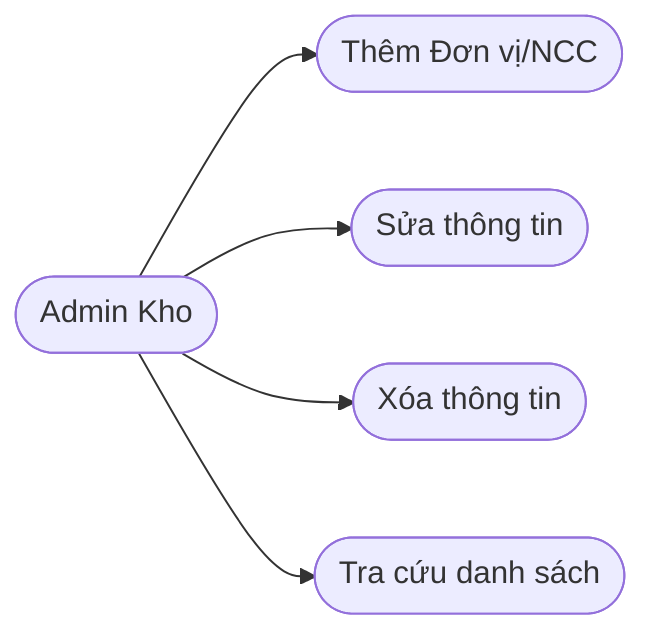

### 2.2.2. Thiết kế cơ sở dữ liệu

**Tên bảng: `units` (Đơn vị tính)**

| STT | Diễn giải | Tên trường | Kiểu dữ liệu | Ràng buộc | Ghi chú |
|---|---|---|---|---|---|
| 1 | Mã đơn vị | id | bigint | PK | Tự động tăng |
| 2 | Tên đơn vị | name | varchar(255) | Not Null | VD: Cái, Thùng, Kg |
| 3 | Mô tả | description | text | Nullable | Ghi chú thêm |
| 4 | Ngày tạo | created_at | timestamp | | |
| 5 | Ngày cập nhật | updated_at | timestamp | | |

**Tên bảng: `suppliers` (Nhà cung cấp)**

| STT | Diễn giải | Tên trường | Kiểu dữ liệu | Ràng buộc | Ghi chú |
|---|---|---|---|---|---|
| 1 | Mã NCC | id | bigint | PK | Tự động tăng |
| 2 | Tên nhà cung cấp | name | varchar(255) | Not Null | VD: Công ty A |
| 3 | Người liên hệ | contact_name| varchar(255) | Nullable | |
| 4 | Số điện thoại | phone | varchar(20) | Nullable | |
| 5 | Email | email | varchar(255) | Nullable | |
| 6 | Địa chỉ | address | text | Nullable | |
| 7 | Ngày tạo | created_at | timestamp | | |
| 8 | Ngày cập nhật | updated_at | timestamp | | |

### 2.2.3. Thiết kế quy trình nghiệp vụ (Sequence Diagram)

**Biểu đồ tuần tự - Thêm Nhà cung cấp mới:**
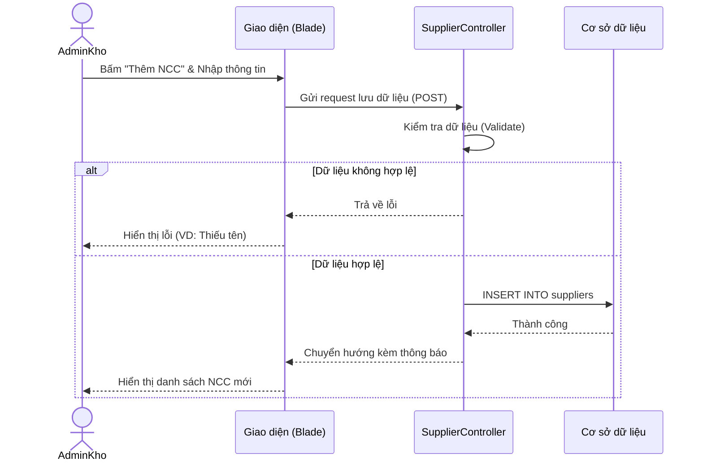

---

## 2.3. Module Quản lý Vật tư
### 2.3.1. Giới thiệu chức năng quản lý vật tư
Chức năng cốt lõi giúp số hóa toàn bộ hàng hóa trong kho. Hệ thống cho phép thêm mới, chỉnh sửa, xóa và tra cứu vật tư. Tính năng nổi bật là khả năng Import/Export vật tư từ file Excel.

**Biểu đồ Use Case Quản lý Vật tư:**
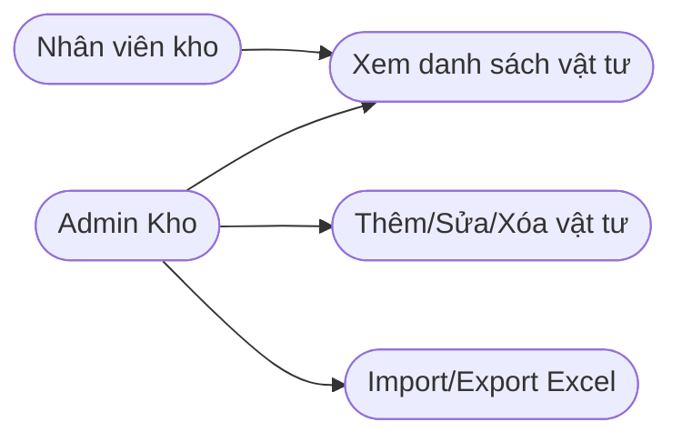

### 2.3.2. Thiết kế cơ sở dữ liệu

**Tên bảng: `materials`**

| STT | Diễn giải | Tên trường | Kiểu dữ liệu | Ràng buộc | Ghi chú |
|---|---|---|---|---|---|
| 1 | Mã vật tư | id | bigint | PK | Tự động tăng |
| 2 | Tên vật tư | name | varchar(255) | Not Null | VD: Dây cáp điện |
| 3 | Mã tham chiếu | sku | varchar(100) | Unique | Mã vạch/SKU |
| 4 | Mã đơn vị | unit_id | bigint | FK, Not Null | Tham chiếu bảng units |
| 5 | Giá tham khảo | price | decimal(15,2)| Not Null | |
| 6 | Tồn tối thiểu | min_stock_level | int | Not Null | Căn cứ để cảnh báo |
| 7 | Hình ảnh | image | varchar(255) | Nullable | Đường dẫn file ảnh |
| 8 | Mô tả | description | text | Nullable | |
| 9 | Ngày tạo | created_at | timestamp | | |
| 10| Ngày cập nhật | updated_at | timestamp | | |

---

## 2.4. Module Quản lý Dự án & Chi nhánh Kho

### 2.4.1. Giới thiệu chức năng

Module này quản lý hai thực thể quan trọng phục vụ cho nghiệp vụ xuất kho:

- **Dự án / Công trình (`projects`):** Là đơn vị nhận vật tư khi xuất kho. Mỗi phiếu xuất kho phải gắn với một công trình cụ thể để theo dõi vật tư được cấp phát cho dự án nào.
- **Chi nhánh Kho (`warehouses`):** Là các kho vật lý nơi lưu trữ vật tư. Hệ thống hỗ trợ quản lý nhiều kho, mỗi kho có người quản lý riêng và trạng thái hoạt động.

### 2.4.2. Tác nhân và biểu đồ ca sử dụng

**Tác nhân:**

- **Admin tổng:** Toàn quyền quản lý kho hàng (thêm, sửa, xóa, phân công người quản lý). Quản lý dự án/công trình.
- **Admin kho:** Quản lý dự án/công trình (thêm, sửa, xóa, xem định mức). Chỉ xem danh sách kho.
- **Nhân viên kho:** Chỉ xem danh sách dự án và kho để tra cứu khi lập phiếu.

**Biểu đồ Use Case - Quản lý Dự án & Chi nhánh Kho:**

```mermaid

```

### 2.4.3. Thiết kế cơ sở dữ liệu

**Tên bảng: `projects` (Dự án / Công trình nhận vật tư)**

> *Lưu ý: Bảng này được đổi tên từ `customers` → `projects` trong quá trình phát triển hệ thống.*

| STT | Diễn giải | Tên trường | Kiểu dữ liệu | Ràng buộc | Ghi chú |
|-----|-----------|------------|--------------|-----------|---------|
| 1 | Mã công trình | id | bigint | PK | Auto increment |
| 2 | Tên công trình | name | varchar(255) | Not Null | |
| 3 | Địa chỉ | address | varchar(255) | Null | Địa điểm thi công |
| 4 | Số điện thoại | phone | varchar(255) | Null | Liên hệ công trình |
| 5 | Thời gian tạo | created_at | timestamp | Not Null | |
| 6 | Thời gian cập nhật | updated_at | timestamp | Not Null | |

**Tên bảng: `warehouses` (Chi nhánh Kho)**

| STT | Diễn giải | Tên trường | Kiểu dữ liệu | Ràng buộc | Ghi chú |
|-----|-----------|------------|--------------|-----------|---------|
| 1 | Mã kho | id | bigint | PK | Auto increment |
| 2 | Tên kho | name | varchar(255) | Not Null | |
| 3 | Địa chỉ | address | varchar(255) | Null | |
| 4 | Người quản lý | manager_id | bigint | FK, Null | Tham chiếu bảng users; set null khi xóa user |
| 5 | Trạng thái | status | varchar(255) | Not Null, default 'active' | active / inactive |
| 6 | Thời gian tạo | created_at | timestamp | Not Null | |
| 7 | Thời gian cập nhật | updated_at | timestamp | Not Null | |

### 2.4.4. Quy trình nghiệp vụ

**a) Thêm công trình mới**

| Mục | Nội dung |
|-----|----------|
| **Mục đích** | Đăng ký công trình để gắn vào phiếu xuất kho khi cấp phát vật tư |
| **Các bước thực hiện** | 1. Admin tổng/Admin kho chọn **"Thêm mới"** trên trang Công trình.<br>2. Nhập thông tin: Tên công trình, Địa chỉ, Số điện thoại.<br>3. Hệ thống lưu và cập nhật danh sách. |
| **Tham chiếu** | Form thêm công trình |

**b) Xem chi tiết / Định mức vật tư công trình**

| Mục | Nội dung |
|-----|----------|
| **Mục đích** | Theo dõi tổng lượng vật tư đã xuất cho từng công trình |
| **Các bước thực hiện** | 1. Admin tổng/Admin kho nhấn **"Chi tiết / Định mức"** bên cạnh công trình.<br>2. Hệ thống hiển thị danh sách vật tư đã xuất kho cho công trình đó kèm số lượng và giá trị. |
| **Tham chiếu** | Trang projects.show |

**c) Thêm kho mới**

| Mục | Nội dung |
|-----|----------|
| **Mục đích** | Đăng ký chi nhánh kho mới khi doanh nghiệp mở rộng |
| **Các bước thực hiện** | 1. Chỉ **Admin tổng** mới thấy nút **"Thêm mới"** trên trang Kho hàng.<br>2. Nhập thông tin: Tên kho, Địa chỉ, Người quản lý kho, Trạng thái.<br>3. Hệ thống lưu và cập nhật danh sách. |
| **Tham chiếu** | Form thêm kho hàng |

### 2.4.5. Thiết kế quy trình nghiệp vụ (Biểu đồ tuần tự)

```mermaid
sequenceDiagram
    actor Admin as Admin Tổng / Admin Kho
    participant UI as Giao diện
    participant Server as Hệ thống
    participant DB as Cơ sở dữ liệu

    Note over Admin,DB: Quản lý Công trình
    Admin->>UI: Truy cập trang Công trình
    UI->>Server: Yêu cầu danh sách công trình
    Server->>DB: SELECT * FROM projects
    DB-->>Server: Trả về danh sách
    Server-->>UI: Hiển thị danh sách (tên, SĐT, địa chỉ)

    alt Thêm công trình
        Admin->>UI: Nhấn "Thêm mới"
        UI-->>Admin: Hiển thị form nhập liệu
        Admin->>UI: Nhập tên, địa chỉ, SĐT
        UI->>Server: Gửi yêu cầu tạo
        Server->>DB: INSERT INTO projects
        Server-->>UI: Thông báo thành công
    end

    alt Xem định mức vật tư
        Admin->>UI: Nhấn "Chi tiết / Định mức"
        UI->>Server: Yêu cầu vật tư đã xuất cho công trình
        Server->>DB: Truy vấn inventory_exits + details theo project_id
        DB-->>Server: Trả về danh sách vật tư + số lượng
        Server-->>UI: Hiển thị chi tiết định mức
    end

    Note over Admin,DB: Quản lý Kho hàng (chỉ Admin Tổng)
    Admin->>UI: Truy cập trang Kho hàng
    UI->>Server: Yêu cầu danh sách kho
    Server->>DB: SELECT * FROM warehouses WITH manager
    DB-->>Server: Trả về danh sách
    Server-->>UI: Hiển thị (tên, địa chỉ, quản lý, trạng thái)

    alt Thêm kho
        Admin->>UI: Nhấn "Thêm mới"
        UI-->>Admin: Hiển thị form nhập liệu
        Admin->>UI: Nhập tên, địa chỉ, chọn người quản lý
        UI->>Server: Gửi yêu cầu tạo kho
        Server->>DB: INSERT INTO warehouses
        Server-->>UI: Thông báo thành công
    end
```

### 2.4.6. Thiết kế giao diện

**Giao diện Quản lý Công trình:** Hiển thị danh sách dạng bảng với các cột **STT**, **Tên công trình**, **Số điện thoại**, **Địa chỉ** và cột **Thao tác**. Admin tổng/Admin kho thấy 3 nút: **"Chi tiết / Định mức"** (xanh nhạt), **"Sửa"** (vàng), **"Xóa"** (đỏ kèm xác nhận).

**Giao diện Quản lý Kho hàng:** Hiển thị danh sách với các cột **STT**, **Tên kho**, **Địa chỉ**, **Quản lý kho**, **Trạng thái** (badge: 🟢 "Đang hoạt động" / ⚫ "Ngừng hoạt động") và cột **Thao tác**. Chỉ **Admin tổng** thấy nút Thêm/Sửa/Xóa.

*Hình 2.X. Giao diện Quản lý Dự án & Chi nhánh Kho*

---

## 2.5. Module Quản lý Phiếu Nhập Kho (Inventory Entries)
### 2.5.1. Giới thiệu chức năng
Ghi nhận quá trình nhập hàng từ nhà cung cấp vào kho. Phiếu nhập được lập bởi nhân viên và phải được Admin duyệt để hệ thống tự động cộng dồn tồn kho.

**Biểu đồ Use Case Nhập Kho:**
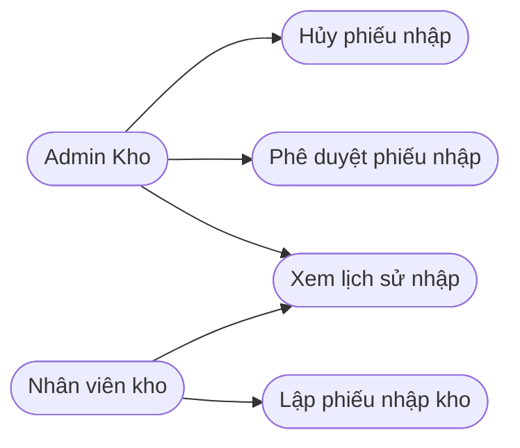

### 2.5.2. Thiết kế cơ sở dữ liệu

**Tên bảng: `inventory_entries` (Phiếu nhập)**

| STT | Diễn giải | Tên trường | Kiểu dữ liệu | Ràng buộc | Ghi chú |
|---|---|---|---|---|---|
| 1 | Mã phiếu | id | bigint | PK | |
| 2 | Mã kho | warehouse_id | bigint | FK, Not Null | Nhập vào kho nào |
| 3 | Mã NCC | supplier_id | bigint | FK, Not Null | |
| 4 | Người lập | created_by | bigint | FK, Not Null | ID nhân viên lập |
| 5 | Người duyệt | approved_by| bigint | FK, Nullable | ID Admin duyệt |
| 6 | Tổng tiền | total_amount| decimal(15,2)| Not Null | |
| 7 | Trạng thái | status | enum | Not Null | pending / approved / cancelled |

**Tên bảng: `inventory_entry_details` (Chi tiết vật tư trong phiếu nhập)**

| STT | Diễn giải | Tên trường | Kiểu dữ liệu | Ràng buộc | Ghi chú |
|---|---|---|---|---|---|
| 1 | Mã chi tiết | id | bigint | PK | |
| 2 | Mã phiếu | inventory_entry_id| bigint | FK | Tham chiếu bảng phiếu nhập |
| 3 | Mã vật tư | material_id | bigint | FK | |
| 4 | Số lượng | quantity | int | Not Null | |
| 5 | Đơn giá | unit_price | decimal(15,2)| Not Null | |

### 2.5.3. Biểu đồ tuần tự - Quy trình duyệt Phiếu nhập
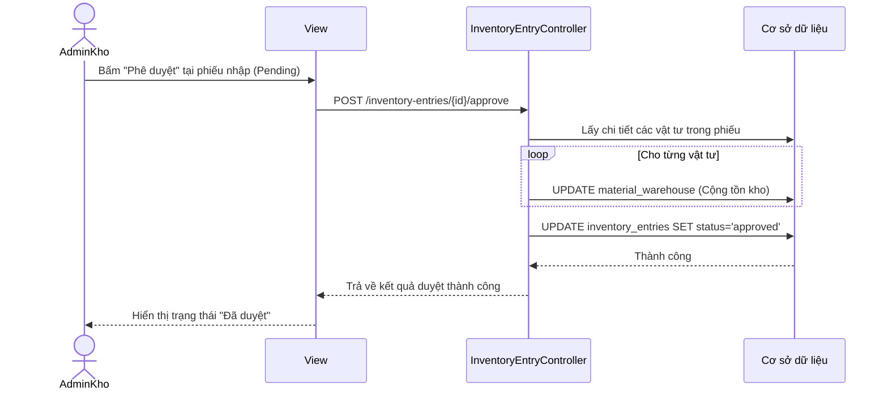

---

## 2.6. Module Quản lý Phiếu Xuất & Chuyển Kho
### 2.6.1. Thiết kế cơ sở dữ liệu

**Tên bảng: `inventory_exits` (Phiếu xuất kho)**

| STT | Diễn giải | Tên trường | Kiểu dữ liệu | Ràng buộc | Ghi chú |
|---|---|---|---|---|---|
| 1 | Mã phiếu | id | bigint | PK | |
| 2 | Kho xuất | warehouse_id | bigint | FK, Not Null | |
| 3 | Dự án nhận| project_id | bigint | FK, Not Null | Xuất cho công trình nào |
| 4 | Người lập | created_by | bigint | FK | |
| 5 | Trạng thái | status | enum | Not Null | pending / approved / cancelled |

**Tên bảng: `inventory_transfers` (Phiếu chuyển kho)**

| STT | Diễn giải | Tên trường | Kiểu dữ liệu | Ràng buộc | Ghi chú |
|---|---|---|---|---|---|
| 1 | Mã phiếu | id | bigint | PK | |
| 2 | Kho nguồn | from_warehouse_id| bigint | FK, Not Null | Kho xuất đi |
| 3 | Kho đích | to_warehouse_id | bigint | FK, Not Null | Kho nhận về |
| 4 | Người lập | created_by | bigint | FK | |
| 5 | Trạng thái | status | enum | Not Null | pending / approved / cancelled |

*(Lưu ý: Bảng chi tiết `inventory_exit_details` và `inventory_transfer_details` có cấu trúc lưu số lượng xuất/chuyển tương tự như chi tiết phiếu nhập)*

---

## 2.7. Module Kiểm kê kho (Inventory Checks)
### 2.7.1. Giới thiệu chức năng
Chức năng này hỗ trợ thủ kho định kỳ đối chiếu số lượng thực tế trong kho với số liệu lưu trữ trên hệ thống. Phiếu kiểm kê giúp phát hiện sự chênh lệch (dôi dư hoặc hao hụt) để từ đó tự động điều chỉnh lại số dư tồn kho cho chuẩn xác sau khi được Admin phê duyệt.

### 2.7.2. Tác nhân và biểu đồ ca sử dụng

**Tác nhân:**

- **Admin tổng / Admin kho:** Xem danh sách phiếu kiểm kê, xem chi tiết phiếu, phê duyệt phiếu (tự động điều chỉnh tồn kho) và hủy phiếu kiểm kê.
- **Nhân viên kho:** Tạo phiếu kiểm kê mới, nhập số lượng thực tế cho từng vật tư, xem kết quả chênh lệch và theo dõi trạng thái phiếu.

**Biểu đồ Use Case Kiểm kê kho:**

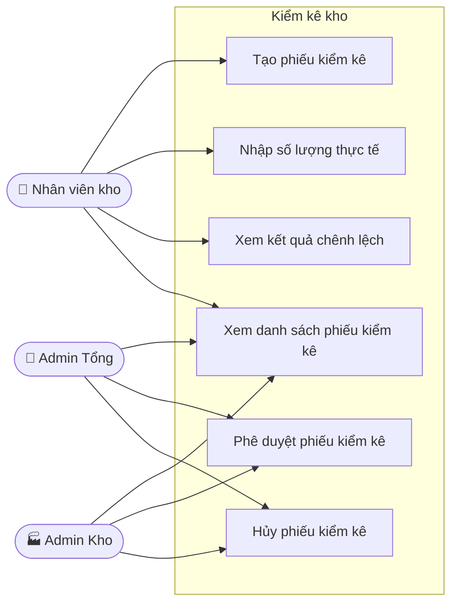

### 2.7.2. Thiết kế cơ sở dữ liệu

**Tên bảng: `inventory_checks` (Phiếu kiểm kê)**

| STT | Diễn giải | Tên trường | Kiểu dữ liệu | Ràng buộc | Ghi chú |
|---|---|---|---|---|---|
| 1 | Mã phiếu | id | bigint | PK | Auto increment |
| 2 | Kho kiểm kê | warehouse_id | bigint | FK, Not Null | Tham chiếu bảng warehouses |
| 3 | Người lập | created_by | bigint | FK, Not Null | Tham chiếu bảng users |
| 4 | Ngày kiểm kê | date | date | Not Null | |
| 5 | Ghi chú | notes | text | Null | |
| 6 | Trạng thái | status | enum | Not Null | pending / completed / cancelled |
| 7 | Thời gian tạo | created_at | timestamp | Not Null | |
| 8 | Thời gian cập nhật | updated_at | timestamp | Not Null | |

**Tên bảng: `inventory_check_details` (Chi tiết kiểm kê)**

| STT | Diễn giải | Tên trường | Kiểu dữ liệu | Ràng buộc | Ghi chú |
|---|---|---|---|---|---|
| 1 | Mã chi tiết | id | bigint | PK | Auto increment |
| 2 | Mã phiếu | inventory_check_id | bigint | FK, Not Null | Tham chiếu bảng inventory_checks |
| 3 | Mã vật tư | material_id | bigint | FK, Not Null | Tham chiếu bảng materials |
| 4 | Tồn hệ thống | system_quantity | decimal | Not Null | Số lượng trên phần mềm tại thời điểm kiểm kê |
| 5 | Tồn thực tế | actual_quantity | decimal | Not Null | Số lượng thủ kho đếm được |
| 6 | Chênh lệch | difference | decimal | Not Null | = actual_quantity - system_quantity |
| 7 | Ghi chú | notes | text | Null | Ghi chú cho từng dòng vật tư |

### 2.7.3. Quy trình nghiệp vụ

Quy trình kiểm kê kho bao gồm các bước chính: nhân viên kho tạo phiếu kiểm kê, nhập số lượng thực tế cho từng vật tư, trình Admin phê duyệt. Sau khi được phê duyệt, hệ thống tự động điều chỉnh tồn kho bằng cách sinh phiếu nhập/xuất bù trừ tương ứng.

**a) Tạo và nhập phiếu kiểm kê**

| Mục | Nội dung |
|-----|----------|
| **Mục đích** | Ghi nhận kết quả kiểm đếm thực tế để đối chiếu với số liệu hệ thống |
| **Các bước thực hiện** | 1. Nhân viên kho chọn **"Tạo phiếu kiểm kê"**.<br>2. Chọn kho cần kiểm kê, nhập ngày kiểm kê.<br>3. Hệ thống tự động load danh sách vật tư trong kho kèm `system_quantity`.<br>4. Nhân viên nhập `actual_quantity` cho từng vật tư.<br>5. Hệ thống tính `difference = actual - system` tự động.<br>6. Lưu phiếu, trạng thái: **pending** (Chờ xử lý). |
| **Tham chiếu** | Form tạo phiếu kiểm kê |

**b) Phê duyệt phiếu kiểm kê**

| Mục | Nội dung |
|-----|----------|
| **Mục đích** | Xác nhận kết quả kiểm kê và tự động điều chỉnh tồn kho |
| **Các bước thực hiện** | 1. Admin kho/Admin tổng xem danh sách phiếu chờ duyệt.<br>2. Xem chi tiết chênh lệch từng vật tư.<br>3. Nhấn **"Duyệt"** — hệ thống tự động sinh phiếu nhập/xuất bù trừ và cập nhật tồn kho; trạng thái → **completed**.<br>4. Hoặc nhấn **"Hủy"** — trạng thái → **cancelled**, tồn kho không thay đổi. |
| **Tham chiếu** | Danh sách phiếu kiểm kê chờ duyệt |

### 2.7.4. Thiết kế quy trình nghiệp vụ (Biểu đồ tuần tự)

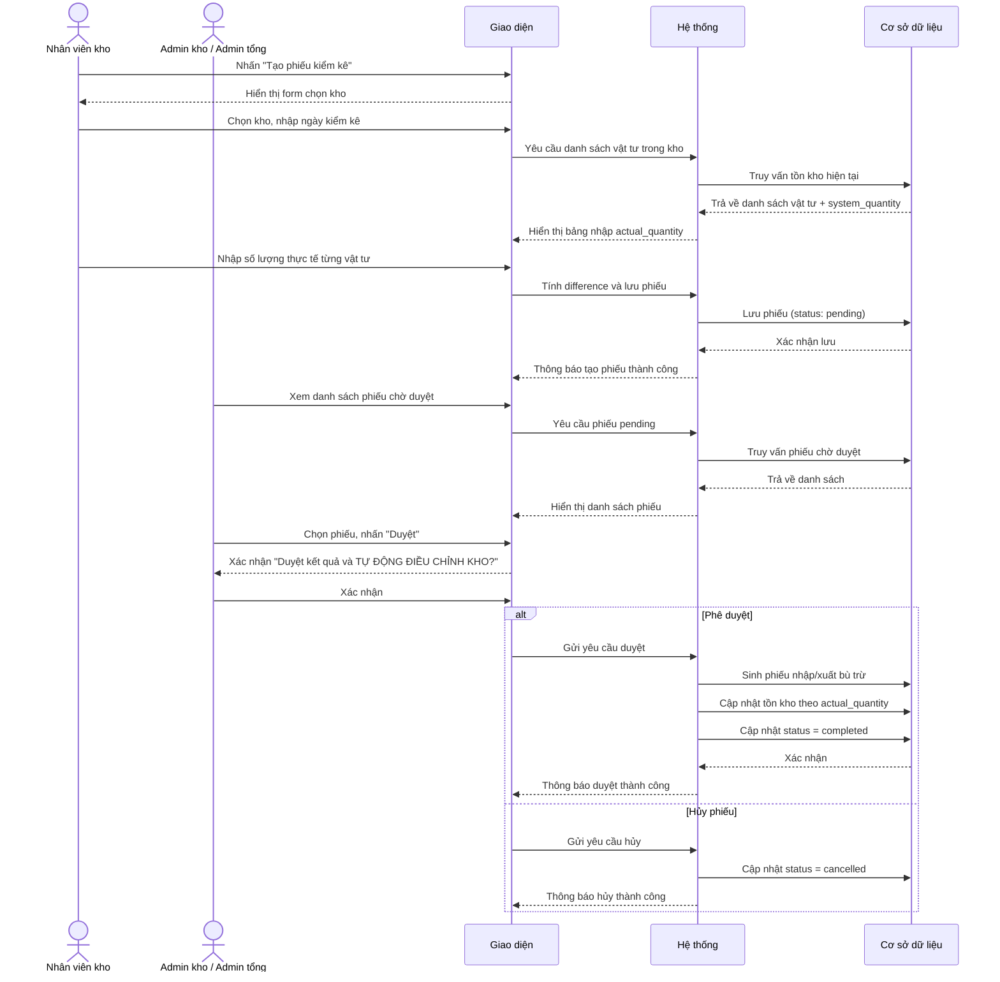

### 2.7.5. Thiết kế giao diện quản lý Kiểm kê kho

Giao diện quản lý kiểm kê kho gồm các phần chính: danh sách phiếu kiểm kê dạng bảng với các cột **ID**, **Ngày kiểm kê**, **Kho hàng**, **Người lập**, **Trạng thái** (badge màu: vàng "Chờ xử lý" / xanh "Đã xử lý") và cột **Thao tác**.

Mọi người dùng đều thấy nút **"Tạo phiếu kiểm kê"**. Mỗi dòng có nút **"Xem"** để xem chi tiết. Với phiếu đang chờ xử lý, Admin kho/Admin tổng thấy thêm nút **"Duyệt"** (kèm cảnh báo sẽ tự động điều chỉnh kho) và nút **"Hủy"**. Form tạo phiếu hiển thị bảng vật tư với cột tồn hệ thống và ô nhập tồn thực tế, tự động tính và hiển thị chênh lệch.

*Hình 2.X. Giao diện quản lý Kiểm kê kho*

---

## 2.8. Module Cảnh báo tồn kho (Inventory Alerts)

### 2.8.1. Giới thiệu chức năng

Chức năng cảnh báo tồn kho tự động giúp đảm bảo kho không bao giờ bị đứt gãy vật tư. Khi số lượng thực tế của một vật tư giảm xuống dưới `min_stock_level` đã thiết lập, hệ thống tự động sinh ra một cảnh báo để người quản lý kịp thời lên kế hoạch nhập bổ sung.

### 2.8.2. Tác nhân và biểu đồ ca sử dụng

**Tác nhân:**

- **Hệ thống (tự động):** Sau mỗi giao dịch xuất kho hoặc sau khi phê duyệt phiếu kiểm kê, hệ thống tự kiểm tra tồn kho và tự động sinh cảnh báo khi phát hiện vật tư dưới mức tối thiểu.
- **Admin tổng / Admin kho:** Xem toàn bộ danh sách cảnh báo, lọc theo trạng thái và đánh dấu đã xử lý.
- **Nhân viên kho:** Xem danh sách cảnh báo thuộc kho phụ trách và đánh dấu đã xử lý.

**Biểu đồ Use Case Cảnh báo tồn kho:**

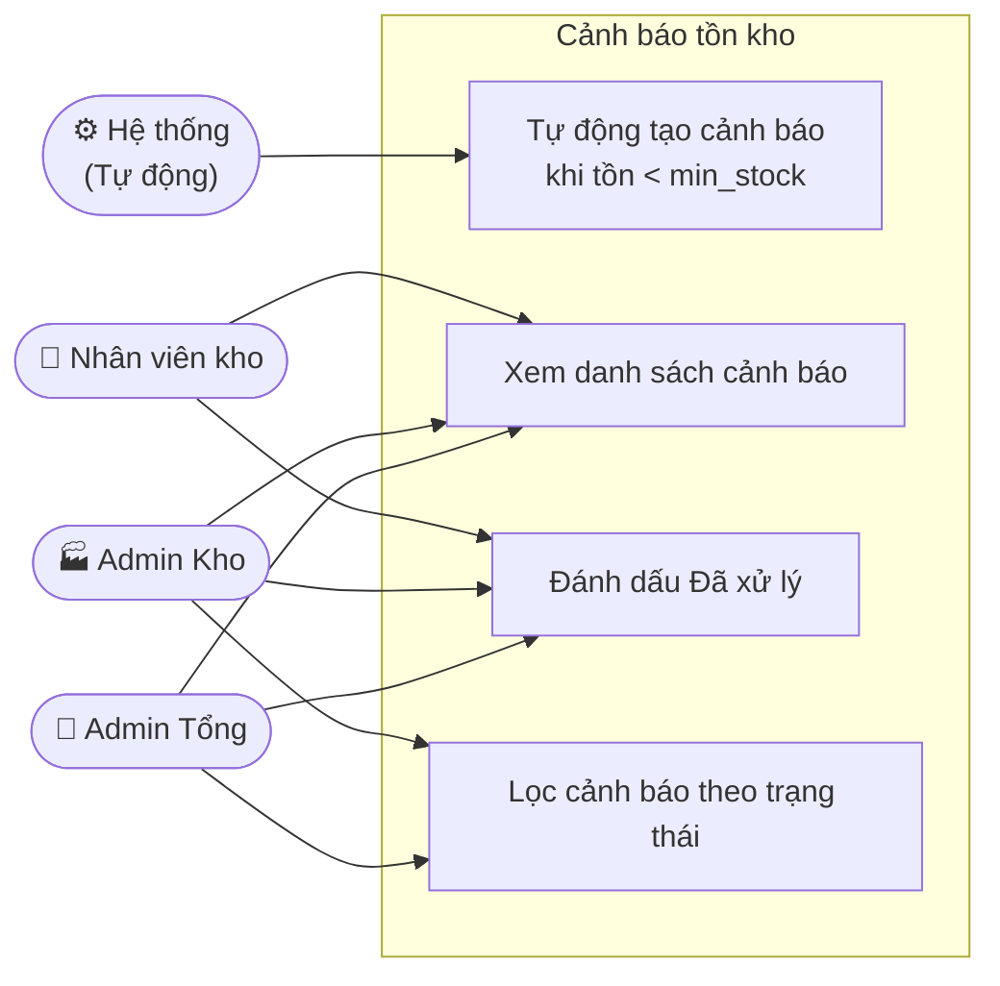

### 2.8.3. Thiết kế cơ sở dữ liệu

**Tên bảng: `inventory_alerts` (Cảnh báo tồn kho)**

| STT | Diễn giải | Tên trường | Kiểu dữ liệu | Ràng buộc | Ghi chú |
|-----|-----------|------------|--------------|-----------|---------|
| 1 | Mã cảnh báo | id | bigint | PK | Auto increment |
| 2 | Mã vật tư | material_id | bigint | FK, Not Null | Tham chiếu bảng materials |
| 3 | Mã kho | warehouse_id | bigint | FK, Not Null | Tham chiếu bảng warehouses |
| 4 | Tồn thực tế | current_stock | decimal | Not Null | Số lượng tại thời điểm cảnh báo |
| 5 | Tồn tối thiểu | min_stock_level | decimal | Not Null | Ngưỡng cảnh báo của vật tư |
| 6 | Trạng thái xử lý | is_resolved | tinyint(1) | Not Null | 0 = Cần nhập hàng / 1 = Đã xử lý |
| 7 | Thời gian tạo | created_at | timestamp | Not Null | Thời điểm hệ thống tạo cảnh báo |
| 8 | Thời gian cập nhật | updated_at | timestamp | Not Null | Thời điểm đánh dấu đã xử lý |


### 2.8.6. Thiết kế giao diện

Giao diện quản lý cảnh báo hiển thị bảng danh sách các vật tư có số lượng dưới mức an toàn với các cột: **Mã vật tư**, **Tên vật tư**, **Tồn tối thiểu**, **Tồn thực tế**, **Trạng thái xử lý** (badge màu: 🟡 "Cần nhập hàng" / 🟢 "Đã xử lý") và **Ngày cảnh báo**.

Tại cột hành động, với các cảnh báo chưa xử lý hiển thị nút **"Xử lý"** — khi nhấn, hộp thoại xác nhận xuất hiện để tránh thao tác nhầm. Sau khi xác nhận, trạng thái cập nhật ngay lập tức trên giao diện, đảm bảo quy trình vận hành kho không bị gián đoạn.

*Hình 2.X. Giao diện Cảnh báo tồn kho*


---

## 2.9. Module Quản lý Nhân viên (Users)

### 2.9.1. Giới thiệu chức năng

Chức năng quản lý nhân viên trong hệ thống quản lý vật tư được thiết kế nhằm hỗ trợ Admin tổng lưu trữ thông tin tài khoản người dùng, phân quyền theo vai trò và kiểm soát quyền truy cập hệ thống. Phạm vi công việc bao gồm tạo tài khoản, gán vai trò (Admin tổng / Admin kho / Nhân viên kho), gán kho phụ trách và khóa/mở khóa tài khoản. Hệ thống đảm bảo tính bảo mật với cơ chế phân quyền chặt chẽ, ngăn chặn truy cập trái phép vào các chức năng nhạy cảm.

### 2.9.2. Tác nhân và biểu đồ ca sử dụng

**Tác nhân:**

- **Admin tổng:** Toàn quyền quản lý tài khoản — thêm mới, chỉnh sửa thông tin, phân vai trò, gán kho phụ trách, khóa/mở khóa và xóa tài khoản. Đây là chức năng chỉ dành riêng cho Admin tổng.

**Biểu đồ Use Case - Quản lý Nhân viên:**

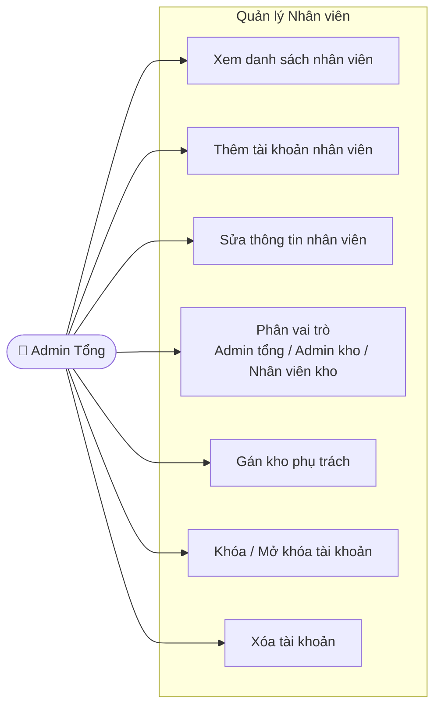

### 2.9.3. Thiết kế cơ sở dữ liệu

**Tên bảng: `users` (Người dùng / Nhân viên)**

| STT | Diễn giải | Tên trường | Kiểu dữ liệu | Ràng buộc | Ghi chú |
|-----|-----------|------------|--------------|-----------|---------|
| 1 | Mã người dùng | id | bigint | PK | Auto increment |
| 2 | Họ và tên | name | varchar(255) | Not Null | |
| 3 | Email đăng nhập | email | varchar(255) | Unique, Not Null | Dùng để đăng nhập |
| 4 | Xác thực email | email_verified_at | timestamp | Null | |
| 5 | Mật khẩu | password | varchar(255) | Not Null | Được mã hóa bcrypt |
| 6 | Vai trò | role | varchar(255) | Not Null | Admin tổng / Admin kho / Nhân viên kho |
| 7 | Kho phụ trách | warehouse_id | bigint | FK, Null | Tham chiếu bảng warehouses; Null nếu là Admin tổng |
| 8 | Trạng thái | status | varchar(255) | Not Null | active / locked |
| 9 | Token ghi nhớ | remember_token | varchar(100) | Null | Dùng cho chức năng "Ghi nhớ đăng nhập" |
| 10 | Thời gian tạo | created_at | timestamp | Not Null | |
| 11 | Thời gian cập nhật | updated_at | timestamp | Not Null | |

### 2.9.4. Quy trình nghiệp vụ

**a) Thêm tài khoản nhân viên**

| Mục | Nội dung |
|-----|----------|
| **Mục đích** | Tạo tài khoản để nhân viên truy cập hệ thống theo đúng quyền hạn |
| **Các bước thực hiện** | 1. Admin tổng chọn **"Thêm mới"** trên trang quản lý người dùng.<br>2. Nhập thông tin: Họ và tên, Email, Mật khẩu, Vai trò, Kho phụ trách.<br>3. Hệ thống kiểm tra email chưa tồn tại trong hệ thống.<br>4. Lưu tài khoản với trạng thái **active**; tài khoản xuất hiện trong danh sách. |
| **Tham chiếu** | Form thêm người dùng |

**b) Phân vai trò và gán kho**

| Mục | Nội dung |
|-----|----------|
| **Mục đích** | Đảm bảo mỗi nhân viên chỉ truy cập được đúng chức năng và kho được phân công |
| **Các bước thực hiện** | 1. Admin tổng chọn nhân viên cần chỉnh sửa, nhấn **"Sửa"**.<br>2. Chọn vai trò: **Admin tổng** / **Admin kho** / **Nhân viên kho**.<br>3. Chọn kho phụ trách (bắt buộc với Admin kho và Nhân viên kho; để trống với Admin tổng).<br>4. Lưu — quyền hạn áp dụng ngay lập tức cho phiên đăng nhập tiếp theo. |
| **Tham chiếu** | Form chỉnh sửa người dùng |

**c) Khóa / Mở khóa tài khoản**

| Mục | Nội dung |
|-----|----------|
| **Mục đích** | Vô hiệu hóa quyền truy cập của nhân viên nghỉ việc hoặc vi phạm mà không xóa dữ liệu |
| **Các bước thực hiện** | 1. Admin tổng chọn nhân viên cần khóa, nhấn **"Sửa"**.<br>2. Đổi trạng thái từ **active** → **locked**.<br>3. Lưu — nhân viên bị khóa không thể đăng nhập, badge trạng thái chuyển sang xám "Đã khóa". |
| **Tham chiếu** | Form chỉnh sửa người dùng |

**d) Xóa tài khoản**

| Mục | Nội dung |
|-----|----------|
| **Mục đích** | Loại bỏ tài khoản không còn sử dụng khỏi hệ thống |
| **Các bước thực hiện** | 1. Admin tổng chọn nhân viên cần xóa, nhấn **"Xóa"**.<br>2. Hệ thống hiển thị hộp thoại xác nhận.<br>3. Nút "Xóa" bị vô hiệu hóa với tài khoản đang đăng nhập (không thể tự xóa mình).<br>4. Sau xác nhận, tài khoản bị xóa khỏi danh sách. |
| **Tham chiếu** | Danh sách người dùng |

### 2.9.5. Thiết kế quy trình nghiệp vụ (Biểu đồ tuần tự)

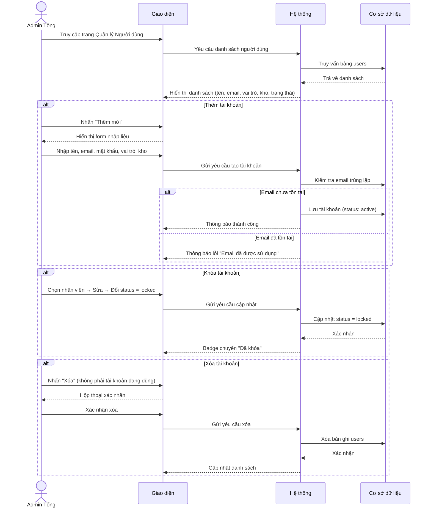

### 2.9.6. Thiết kế giao diện quản lý Nhân viên

Giao diện quản lý người dùng hiển thị danh sách tài khoản dạng bảng với các cột: **STT**, **Họ và tên**, **Email**, **Vai trò** (badge màu: 🔴 đỏ "Admin tổng" / 🟡 vàng "Admin kho" / 🔵 xanh nhạt "Nhân viên kho"), **Kho quản lý/làm việc**, **Trạng thái** (badge: 🟢 xanh "Đang hoạt động" / ⚫ xám "Đã khóa") và cột **Thao tác**.

Chỉ **Admin tổng** mới có quyền truy cập trang này. Nút **"Thêm mới"** dẫn đến form nhập thông tin. Mỗi dòng có nút **"Sửa"** (chỉnh sửa thông tin, đổi vai trò, khóa/mở khóa) và **"Xóa"** — nút Xóa bị vô hiệu hóa với tài khoản đang đăng nhập để tránh tự xóa mình.

*Hình 2.X. Giao diện quản lý Nhân viên*


---

## 2.10. Module Quản lý Báo cáo thống kê

### 2.10.1. Giới thiệu chức năng

Chức năng báo cáo thống kê trong hệ thống quản lý vật tư được thiết kế nhằm hỗ trợ ban lãnh đạo và quản trị viên tổng hợp dữ liệu tồn kho theo thời gian thực. Hệ thống **không lưu báo cáo vào bảng riêng** mà tổng hợp trực tiếp từ bảng `material_warehouses` — bảng lưu trữ số lượng tồn kho và giá vốn bình quân của từng vật tư tại từng kho. Phạm vi công việc bao gồm xem báo cáo tồn kho, lọc theo kho, tính tổng giá trị tài sản kho và xuất báo cáo ra file Excel/PDF.

### 2.10.2. Tác nhân và biểu đồ ca sử dụng

**Tác nhân:**

- **Admin tổng:** Xem báo cáo tồn kho của tất cả các kho, lọc theo từng kho cụ thể, xuất Excel/PDF, in báo cáo.
- **Admin kho / Nhân viên kho:** Xem báo cáo tồn kho của kho mình phụ trách, xuất Excel/PDF, in báo cáo.

**Biểu đồ Use Case - Báo cáo thống kê:**

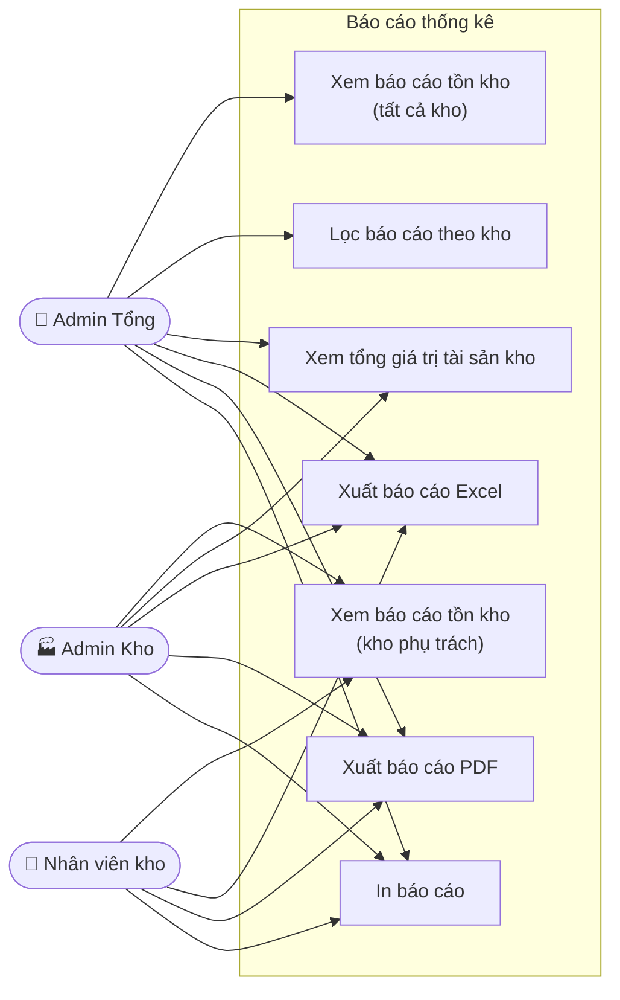

### 2.10.3. Thiết kế cơ sở dữ liệu

Báo cáo thống kê không có bảng lưu trữ riêng. Dữ liệu được tổng hợp trực tiếp từ bảng **`material_warehouses`** — bảng trung gian lưu trạng thái tồn kho hiện tại của từng vật tư tại từng kho, được cập nhật tự động sau mỗi giao dịch nhập/xuất được duyệt.

**Tên bảng: `material_warehouses` (Tồn kho theo kho)**

| STT | Diễn giải | Tên trường | Kiểu dữ liệu | Ràng buộc | Ghi chú |
|-----|-----------|------------|--------------|-----------|---------|
| 1 | Mã bản ghi | id | bigint | PK | Auto increment |
| 2 | Mã kho | warehouse_id | bigint | FK, Not Null | Tham chiếu bảng warehouses; cascade delete |
| 3 | Mã vật tư | material_id | bigint | FK, Not Null | Tham chiếu bảng materials; cascade delete |
| 4 | Số lượng tồn | stock | decimal(10,2) | Not Null, default 0 | Tự động cập nhật sau mỗi giao dịch được duyệt |
| 5 | Vị trí trong kho | location | varchar(255) | Null | Ví dụ: Kệ A1, Tầng 2... |
| 6 | Giá vốn bình quân | average_cost | decimal(15,2) | Not Null, default 0 | Tính theo phương pháp bình quân gia quyền |
| 7 | Thời gian tạo | created_at | timestamp | Not Null | |
| 8 | Thời gian cập nhật | updated_at | timestamp | Not Null | |

> **Ràng buộc duy nhất:** Cặp `(warehouse_id, material_id)` là duy nhất — mỗi vật tư chỉ có một bản ghi tồn kho tại mỗi kho.

**Công thức tính trong báo cáo:**

| Chỉ số | Công thức |
|--------|-----------|
| Giá trị tồn của một vật tư | `stock × average_cost` |
| Tổng giá trị tài sản kho | `Σ (stock × average_cost)` của tất cả vật tư trong kho |

### 2.10.4. Quy trình nghiệp vụ

**a) Xem báo cáo tồn kho**

| Mục | Nội dung |
|-----|----------|
| **Mục đích** | Theo dõi số lượng và giá trị tồn kho hiện tại để ra quyết định nhập hàng |
| **Các bước thực hiện** | 1. Người dùng truy cập trang **Báo cáo Tồn kho**.<br>2. Hệ thống tự động lọc theo kho phụ trách (Admin kho/Nhân viên kho) hoặc hiển thị tất cả (Admin tổng).<br>3. Admin tổng có thể chọn kho cụ thể từ dropdown để lọc.<br>4. Hệ thống tổng hợp dữ liệu từ `material_warehouses`, tính giá trị tồn và tổng giá trị tài sản.<br>5. Hiển thị bảng kết quả và tổng cuối trang. |
| **Tham chiếu** | Trang reports/inventory |

**b) Xuất báo cáo**

| Mục | Nội dung |
|-----|----------|
| **Mục đích** | Lưu trữ hoặc chia sẻ báo cáo tồn kho dưới dạng file |
| **Các bước thực hiện** | 1. Người dùng nhấn **"Xuất Excel"** hoặc **"Xuất PDF"** (hoặc **"In báo cáo"**).<br>2. Hệ thống tổng hợp dữ liệu tồn kho theo bộ lọc hiện tại.<br>3. Tạo file và trả về link tải xuống tự động.<br>4. Với in báo cáo: giao diện ẩn thanh điều hướng, chỉ hiển thị bảng dữ liệu. |
| **Tham chiếu** | Route reports.inventory.export-excel / export-pdf |

### 2.10.5. Thiết kế quy trình nghiệp vụ (Biểu đồ tuần tự)

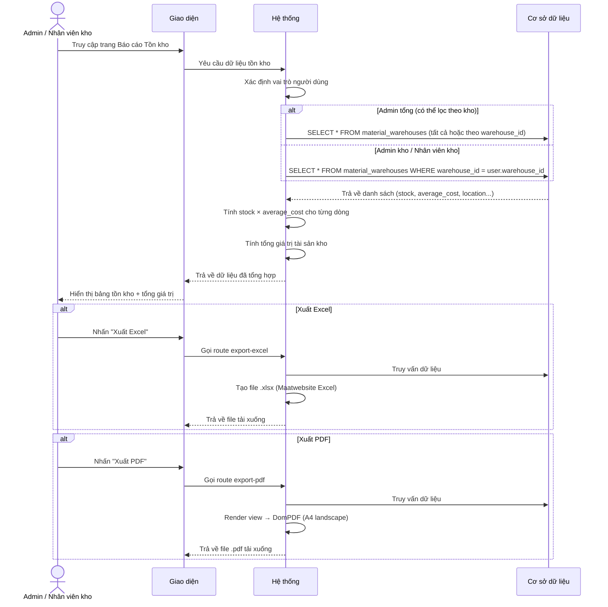

### 2.10.6. Thiết kế giao diện Báo cáo thống kê

Giao diện báo cáo tồn kho hiển thị bảng số liệu với các cột: **STT**, **Kho hàng**, **Tên vật tư**, **ĐVT**, **Vị trí** (badge xám), **Tồn hiện tại** (màu xanh, font lớn), **Giá vốn** (giá vốn bình quân), **Giá trị tồn**. Hàng cuối bảng hiển thị **Tổng giá trị tài sản kho** (màu đỏ, font lớn).

Admin tổng thấy thêm dropdown chọn kho để lọc báo cáo. Các nút thao tác: **"Xuất Excel"** (xanh lá), **"Xuất PDF"** (đỏ), **"In báo cáo"** (xám). Khi in, giao diện tự động ẩn thanh điều hướng và các nút thao tác, chỉ hiển thị bảng dữ liệu.

*Hình 2.X. Giao diện Báo cáo Tồn kho*
