# 2.1. Phân tích yêu cầu và xác định các tác nhân

## 2.1.1. Phân tích yêu cầu của hệ thống

Hệ thống quản lý vật tư được thiết kế nhằm hỗ trợ các tác nhân chính (quản trị viên, nhân viên kho, nhân viên mua hàng) thực hiện các nghiệp vụ quản lý vật tư một cách hiệu quả.

## 2.1.2. Xác định tác nhân

| Tác nhân | Mô tả | Quyền hạn chính |
|----------|-------|-----------------|
| **Admin Tổng** | Quản trị viên cấp cao, toàn quyền hệ thống | Quản lý người dùng, kho bãi, danh mục, phê duyệt giao dịch, xem báo cáo |
| **Admin Kho** | Quản lý kho, chịu trách nhiệm vận hành kho | Quản lý danh mục, phê duyệt giao dịch, xem báo cáo |
| **Nhân viên kho** | Thủ kho, thực hiện nhập xuất hàng ngày | Lập phiếu giao dịch kho, tra cứu báo cáo |

## 2.1.3. Biểu đồ Use Case tổng quan

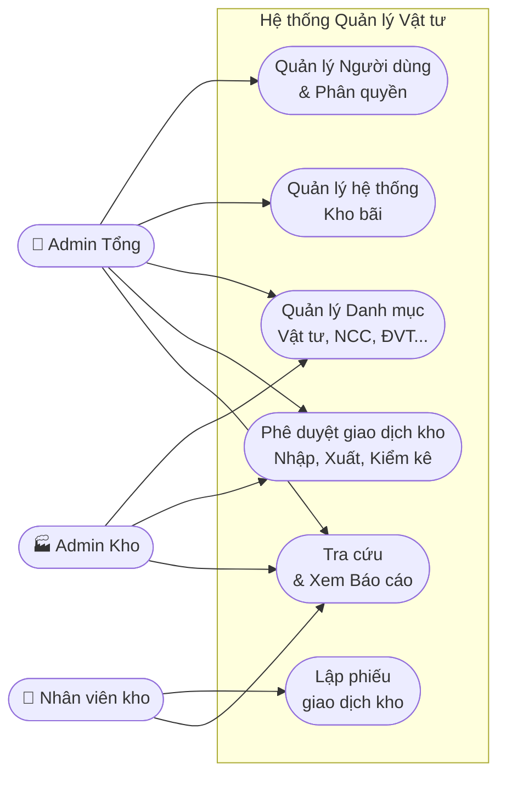
```mermaid
flowchart LR
    AdminTong(["👑 Admin Tổng"])
    AdminKho(["🏭 Admin Kho"])
    NhanVien(["👷 Nhân viên kho"])

    subgraph HT ["Hệ thống Quản lý Vật tư"]
        UC1(["Quản lý Người dùng\n& Phân quyền"])
        UC2(["Quản lý hệ thống\nKho bãi"])
        UC3(["Quản lý Danh mục\nVật tư, NCC, ĐVT..."])
        UC4(["Phê duyệt giao dịch kho\nNhập, Xuất, Kiểm kê"])
        UC5(["Lập phiếu\ngiao dịch kho"])
        UC6(["Tra cứu\n& Xem Báo cáo"])
    end

    AdminTong --> UC1
    AdminTong --> UC2
    AdminTong --> UC3
    AdminTong --> UC4
    AdminTong --> UC6

    AdminKho --> UC3
    AdminKho --> UC4
    AdminKho --> UC6

    NhanVien --> UC5
    NhanVien --> UC6
```

## 2.1.4. Bảng phân tích sprint

| Sprint | Nội dung | Mục đích |
|--------|----------|----------|
| 1 | Quản lý danh mục vật tư | Chức năng quản lý danh mục vật tư giúp doanh nghiệp lưu trữ và cập nhật thông tin phân loại vật tư chính xác, hỗ trợ tìm kiếm nhanh, theo dõi tồn kho và quản lý sản phẩm hiệu quả, từ đó nâng cao chất lượng vận hành và tối ưu hoạt động sản xuất kinh doanh. |
| 2 | Quản lý vật tư | Chức năng quản lý vật tư giúp doanh nghiệp lưu trữ, cập nhật và theo dõi đầy đủ thông tin của từng loại vật tư, bao gồm tên vật tư, đơn vị tính, danh mục, nhà cung cấp, giá và số lượng tồn kho. Nhờ đó, việc tìm kiếm, tra cứu và điều chỉnh dữ liệu trở nên nhanh chóng, chính xác, hỗ trợ quản lý vật tư hiệu quả và phục vụ sản xuất tốt hơn. |
| 3 | Quản lý kho | Chức năng quản lý kho giúp doanh nghiệp theo dõi số lượng vật tư nhập – xuất – tồn một cách chính xác. Hệ thống hỗ trợ cập nhật tồn kho tự động sau mỗi giao dịch, cảnh báo khi số lượng thấp và giúp kiểm kê hiệu quả. Nhờ đó, doanh nghiệp chủ động trong việc nhập hàng, tránh thiếu hụt hoặc tồn kho quá lâu. |
| 4 | Quản lý nhập xuất kho | Chức năng quản lý nhập xuất kho giúp theo dõi và xử lý các phiếu nhập, phiếu xuất vật tư, từ lúc tạo phiếu đến khi hoàn tất giao nhận. Hệ thống lưu thông tin vật tư, số lượng, giá tiền và trạng thái phiếu, giúp việc xử lý nhanh chóng, giảm sai sót và nâng cao hiệu quả quản lý kho. |
| 5 | Quản lý nhà cung cấp | Chức năng quản lý nhà cung cấp giúp lưu trữ thông tin đối tác cung ứng như tên công ty, số điện thoại, địa chỉ và lịch sử giao dịch. Nhờ đó, doanh nghiệp dễ dàng đánh giá, lựa chọn nhà cung cấp phù hợp và nâng cao chất lượng chuỗi cung ứng. |
| 6 | Quản lý nhân viên | Chức năng quản lý nhân viên giúp lưu trữ thông tin nhân sự, phân quyền theo vai trò và theo dõi hoạt động làm việc. Nhờ đó, doanh nghiệp quản lý hiệu quả công việc, đảm bảo phân công đúng nhiệm vụ và tăng tính bảo mật cho hệ thống. |
| 7 | Quản lý báo cáo | Chức năng quản lý báo cáo thống kê giúp tổng hợp dữ liệu về nhập xuất kho, tồn kho, vật tư sử dụng nhiều và chi phí mua hàng. Nhờ đó, ban lãnh đạo dễ dàng đánh giá hiệu quả hoạt động và đưa ra quyết định phù hợp để tối ưu chi phí vật tư. |
| 8 | Đăng nhập, đăng ký | Chức năng đăng nhập – đăng ký cho phép người dùng tạo tài khoản và truy cập hệ thống theo đúng quyền hạn. Hệ thống đảm bảo bảo mật thông tin, giúp phân biệt vai trò người dùng như quản trị viên, nhân viên kho hay nhân viên mua hàng, đảm bảo sử dụng an toàn và hiệu quả. |

---

# 2.2. Module Quản lý Đơn vị tính và Nhà cung cấp

## 2.2.1. Giới thiệu chức năng

Chức năng quản lý đơn vị tính và nhà cung cấp trong hệ thống quản lý vật tư được thiết kế nhằm hỗ trợ quản trị viên và nhân viên kho quản lý toàn bộ thông tin chuẩn hóa dữ liệu đầu vào một cách hiệu quả. Phạm vi công việc bao gồm phân tích dữ liệu đơn vị tính (Cái, Chiếc, Kg, Mét...) và thông tin nhà cung cấp, xây dựng bảng cơ sở dữ liệu lưu trữ, phát triển các tính năng thêm, sửa, xóa và cập nhật thông tin. Bên cạnh đó, hệ thống cho phép hiển thị danh sách đơn vị tính và nhà cung cấp theo nhiều tiêu chí như tên, địa chỉ, số điện thoại hoặc trạng thái hoạt động, đồng thời đảm bảo khả năng truy cập và thao tác linh hoạt theo từng phân quyền của người dùng.

## 2.2.2. Tác nhân và biểu đồ ca sử dụng

- **Quản trị viên:** Quản lý toàn bộ thông tin đơn vị tính và nhà cung cấp, bao gồm thêm mới, chỉnh sửa thông tin, xóa, cập nhật trạng thái và phân loại nhà cung cấp theo nhóm hàng.
- **Nhân viên kho:** Xem danh sách đơn vị tính và nhà cung cấp, tra cứu thông tin khi lập phiếu nhập xuất kho, đồng thời hỗ trợ chỉnh sửa thông tin nếu được phân quyền.
- **Nhân viên mua hàng:** Xem danh sách nhà cung cấp, tìm kiếm nhà cung cấp theo tên, địa chỉ, mặt hàng cung ứng, và xem thông tin chi tiết của từng nhà cung cấp khi cần lập đơn đặt hàng.

### Biểu đồ Use Case - Quản lý Đơn vị tính

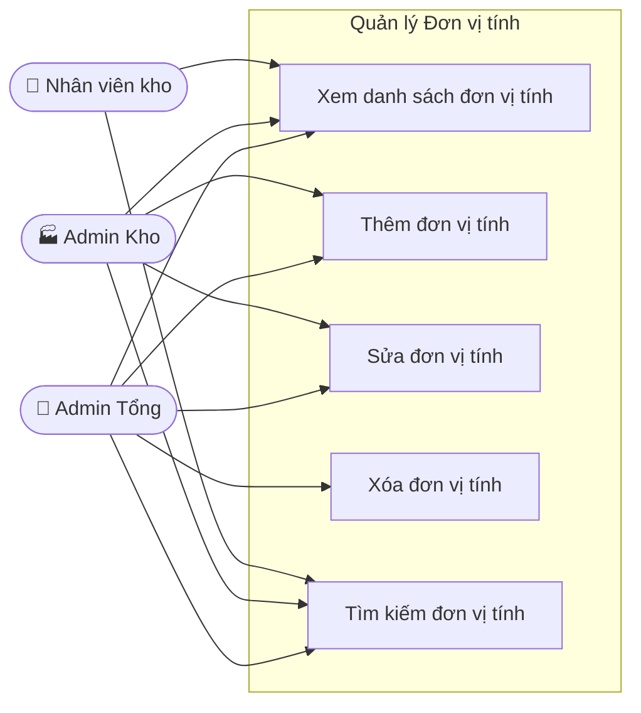
```mermaid
flowchart LR
    AdminTong(["👑 Admin Tổng"])
    AdminKho(["🏭 Admin Kho"])
    NhanVien(["👷 Nhân viên kho"])

    subgraph UC_DonVi [Quản lý Đơn vị tính]
        UC1["Xem danh sách đơn vị tính"]
        UC2["Thêm đơn vị tính"]
        UC3["Sửa đơn vị tính"]
        UC4["Xóa đơn vị tính"]
        UC5["Tìm kiếm đơn vị tính"]
    end

    AdminTong --> UC1
    AdminTong --> UC2
    AdminTong --> UC3
    AdminTong --> UC4
    AdminTong --> UC5

    AdminKho --> UC1
    AdminKho --> UC2
    AdminKho --> UC3
    AdminKho --> UC5

    NhanVien --> UC1
    NhanVien --> UC5
```

### Biểu đồ Use Case - Quản lý Nhà cung cấp

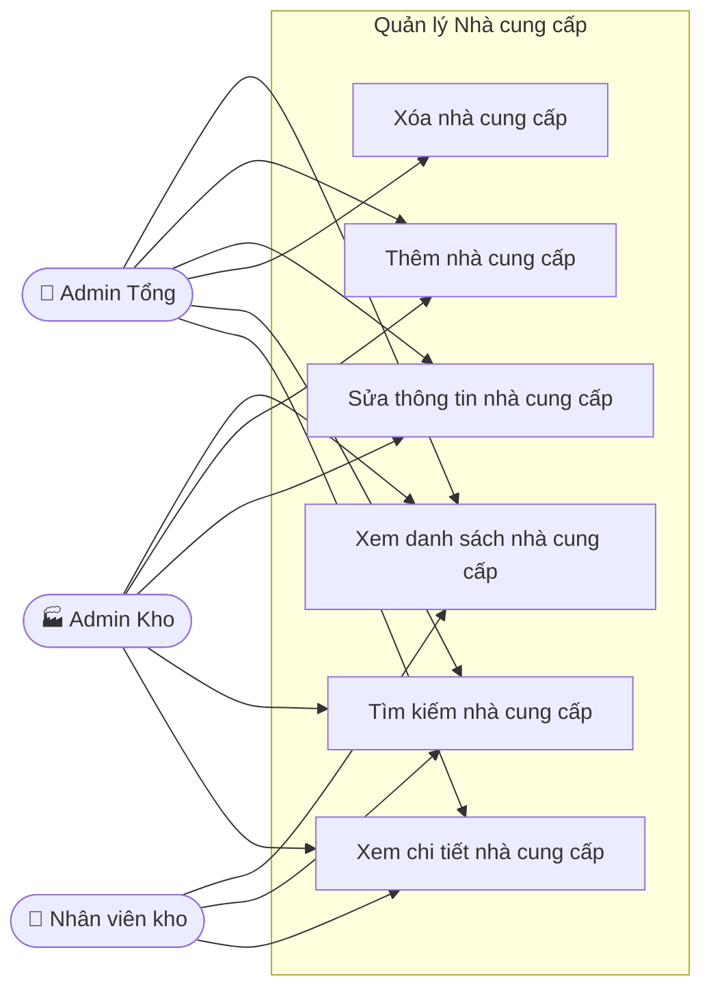
```mermaid
flowchart LR
    AdminTong(["👑 Admin Tổng"])
    AdminKho(["🏭 Admin Kho"])
    NhanVien(["👷 Nhân viên kho"])

    subgraph UC_NCC [Quản lý Nhà cung cấp]
        UC1["Xem danh sách nhà cung cấp"]
        UC2["Thêm nhà cung cấp"]
        UC3["Sửa thông tin nhà cung cấp"]
        UC4["Xóa nhà cung cấp"]
        UC5["Tìm kiếm nhà cung cấp"]
        UC6["Xem chi tiết nhà cung cấp"]
    end

    AdminTong --> UC1
    AdminTong --> UC2
    AdminTong --> UC3
    AdminTong --> UC4
    AdminTong --> UC5
    AdminTong --> UC6

    AdminKho --> UC1
    AdminKho --> UC2
    AdminKho --> UC3
    AdminKho --> UC5
    AdminKho --> UC6

    NhanVien --> UC1
    NhanVien --> UC5
    NhanVien --> UC6
```

## 2.2.3. Quy trình quản lý Đơn vị tính và Nhà cung cấp

Quản lý đơn vị tính và nhà cung cấp bao gồm các thao tác chính như thêm mới, chỉnh sửa thông tin, xóa và hiển thị danh sách trong hệ thống. Những chức năng này giúp doanh nghiệp tổ chức và cập nhật dữ liệu một cách khoa học, chính xác và thuận tiện. Chi tiết các thao tác như sau:

### a) Thêm mới đơn vị tính / nhà cung cấp

Hệ thống cho phép quản trị viên hoặc nhân viên nhập thông tin mới bao gồm tên đơn vị tính (hoặc tên nhà cung cấp, địa chỉ, số điện thoại, email, người liên hệ). Việc thêm mới giúp cập nhật dữ liệu kịp thời khi doanh nghiệp có đối tác mới hoặc cần bổ sung đơn vị tính.

| Mục | Nội dung |
|-----|----------|
| **Mục đích** | Thêm một đơn vị tính hoặc nhà cung cấp vào hệ thống để quản lý và theo dõi thông tin |
| **Các bước thực hiện** | 1. Quản trị viên/nhân viên chọn tính năng thêm mới đơn vị tính hoặc nhà cung cấp trong hệ thống. 2. Quản trị viên/nhân viên nhập các thông tin cần thiết vào form, bao gồm: Tên đơn vị tính (hoặc Mã NCC, tên nhà cung cấp, địa chỉ, số điện thoại, email, người liên hệ, nhóm hàng cung ứng). 3. Hệ thống kiểm tra tính hợp lệ của thông tin: Tên đơn vị tính không được trùng lặp; Mã nhà cung cấp không được trùng với nhà cung cấp đã tồn tại trong hệ thống. 4. Hệ thống lưu thông tin và cập nhật danh sách hiển thị cho người dùng. |
| **Tham chiếu** | Form thêm đơn vị tính, Form thêm nhà cung cấp |

### b) Chỉnh sửa thông tin đơn vị tính / nhà cung cấp

Khi có thay đổi về tên đơn vị tính, thông tin liên hệ nhà cung cấp hoặc các thông tin liên quan, người quản lý có thể chỉnh sửa để đảm bảo dữ liệu luôn chính xác và cập nhật.

| Mục | Nội dung |
|-----|----------|
| **Mục đích** | Chỉnh sửa thông tin đơn vị tính hoặc nhà cung cấp trên hệ thống để cập nhật dữ liệu chính xác |
| **Các bước thực hiện** | 1. Quản trị viên/nhân viên chọn mục sửa thông tin trong hệ thống. 2. Quản trị viên/nhân viên tìm kiếm và chọn đơn vị tính hoặc nhà cung cấp cần chỉnh sửa. 3. Quản trị viên/nhân viên thực hiện chỉnh sửa thông tin: Tên đơn vị tính (hoặc tên NCC, địa chỉ, số điện thoại, email, người liên hệ, trạng thái hoạt động). 4. Hệ thống kiểm tra thông tin đã chỉnh sửa có hợp lệ hay không, đặc biệt là tên không trùng với bản ghi khác. 5. Hệ thống lưu lại thông tin cập nhật và làm mới danh sách hiển thị cho người dùng. |
| **Tham chiếu** | Form chỉnh sửa đơn vị tính, Form chỉnh sửa nhà cung cấp |

### c) Xóa đơn vị tính / nhà cung cấp

Chức năng xóa cho phép loại bỏ những đơn vị tính không còn sử dụng hoặc nhà cung cấp đã ngừng hợp tác. Việc này giúp danh sách luôn gọn gàng và dễ quản lý.

| Mục | Nội dung |
|-----|----------|
| **Mục đích** | Xóa thông tin đơn vị tính hoặc nhà cung cấp không còn hoạt động trên hệ thống để duy trì cơ sở dữ liệu sạch và chính xác |
| **Các bước thực hiện** | 1. Quản trị viên/nhân viên chọn mục xóa trong hệ thống. 2. Quản trị viên/nhân viên tìm kiếm và chọn đơn vị tính hoặc nhà cung cấp cần xóa. 3. Hệ thống yêu cầu xác nhận lại việc xóa để tránh thao tác nhầm. 4. Hệ thống kiểm tra xem đơn vị tính có đang được sử dụng bởi vật tư nào không, hoặc nhà cung cấp có đang liên kết với phiếu nhập kho hay không. 5. Hệ thống tiến hành xóa khỏi cơ sở dữ liệu (hoặc thông báo không thể xóa nếu đang có liên kết). 6. Hệ thống cập nhật và làm mới danh sách để hiển thị kết quả mới nhất. |
| **Tham chiếu** | Danh sách đơn vị tính, Danh sách nhà cung cấp |

## 2.2.4. Thiết kế quy trình nghiệp vụ

### Biểu đồ tuần tự - Quản lý Đơn vị tính

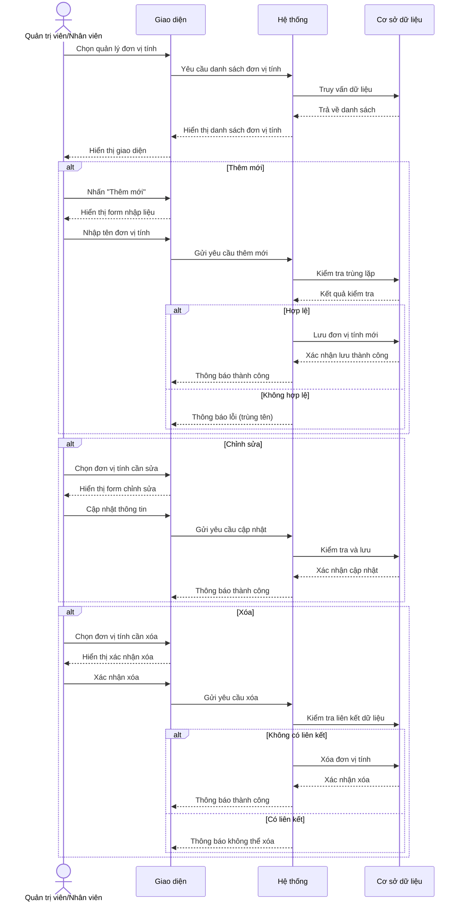
```mermaid
sequenceDiagram
    actor User as Quản trị viên/Nhân viên
    participant UI as Giao diện
    participant Server as Hệ thống
    participant DB as Cơ sở dữ liệu

    User->>UI: Chọn quản lý đơn vị tính
    UI->>Server: Yêu cầu danh sách đơn vị tính
    Server->>DB: Truy vấn dữ liệu
    DB-->>Server: Trả về danh sách
    Server-->>UI: Hiển thị danh sách đơn vị tính
    UI-->>User: Hiển thị giao diện

    alt Thêm mới
        User->>UI: Nhấn "Thêm mới"
        UI-->>User: Hiển thị form nhập liệu
        User->>UI: Nhập tên đơn vị tính
        UI->>Server: Gửi yêu cầu thêm mới
        Server->>DB: Kiểm tra trùng lặp
        DB-->>Server: Kết quả kiểm tra
        alt Hợp lệ
            Server->>DB: Lưu đơn vị tính mới
            DB-->>Server: Xác nhận lưu thành công
            Server-->>UI: Thông báo thành công
        else Không hợp lệ
            Server-->>UI: Thông báo lỗi (trùng tên)
        end
    end

    alt Chỉnh sửa
        User->>UI: Chọn đơn vị tính cần sửa
        UI-->>User: Hiển thị form chỉnh sửa
        User->>UI: Cập nhật thông tin
        UI->>Server: Gửi yêu cầu cập nhật
        Server->>DB: Kiểm tra và lưu
        DB-->>Server: Xác nhận cập nhật
        Server-->>UI: Thông báo thành công
    end

    alt Xóa
        User->>UI: Chọn đơn vị tính cần xóa
        UI-->>User: Hiển thị xác nhận xóa
        User->>UI: Xác nhận xóa
        UI->>Server: Gửi yêu cầu xóa
        Server->>DB: Kiểm tra liên kết dữ liệu
        alt Không có liên kết
            Server->>DB: Xóa đơn vị tính
            DB-->>Server: Xác nhận xóa
            Server-->>UI: Thông báo thành công
        else Có liên kết
            Server-->>UI: Thông báo không thể xóa
        end
    end
```

### Biểu đồ tuần tự - Quản lý Nhà cung cấp

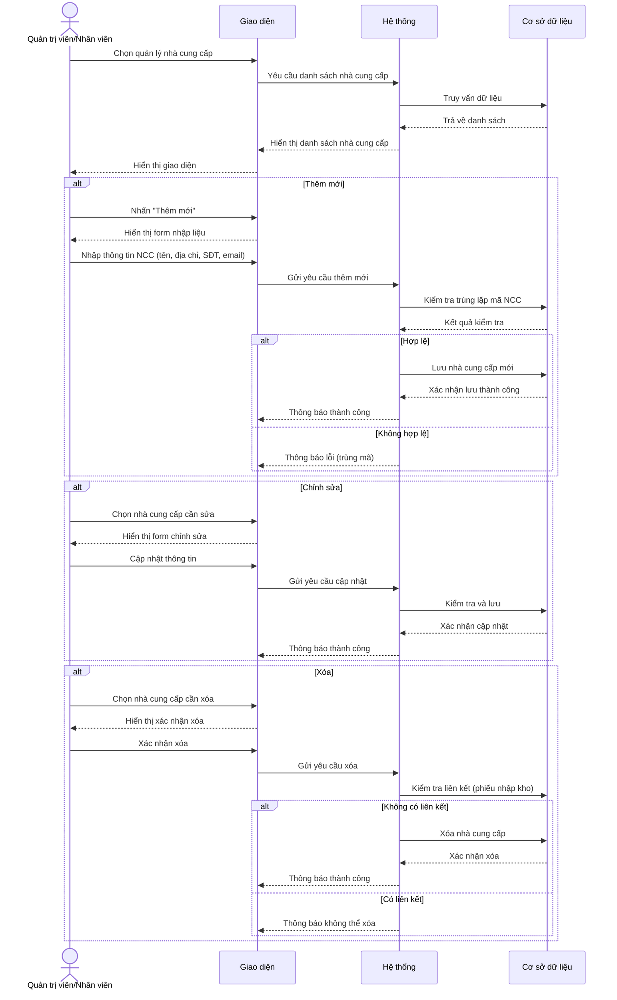
```mermaid
sequenceDiagram
    actor User as Quản trị viên/Nhân viên
    participant UI as Giao diện
    participant Server as Hệ thống
    participant DB as Cơ sở dữ liệu

    User->>UI: Chọn quản lý nhà cung cấp
    UI->>Server: Yêu cầu danh sách nhà cung cấp
    Server->>DB: Truy vấn dữ liệu
    DB-->>Server: Trả về danh sách
    Server-->>UI: Hiển thị danh sách nhà cung cấp
    UI-->>User: Hiển thị giao diện

    alt Thêm mới
        User->>UI: Nhấn "Thêm mới"
        UI-->>User: Hiển thị form nhập liệu
        User->>UI: Nhập thông tin NCC (tên, địa chỉ, SĐT, email)
        UI->>Server: Gửi yêu cầu thêm mới
        Server->>DB: Kiểm tra trùng lặp mã NCC
        DB-->>Server: Kết quả kiểm tra
        alt Hợp lệ
            Server->>DB: Lưu nhà cung cấp mới
            DB-->>Server: Xác nhận lưu thành công
            Server-->>UI: Thông báo thành công
        else Không hợp lệ
            Server-->>UI: Thông báo lỗi (trùng mã)
        end
    end

    alt Chỉnh sửa
        User->>UI: Chọn nhà cung cấp cần sửa
        UI-->>User: Hiển thị form chỉnh sửa
        User->>UI: Cập nhật thông tin
        UI->>Server: Gửi yêu cầu cập nhật
        Server->>DB: Kiểm tra và lưu
        DB-->>Server: Xác nhận cập nhật
        Server-->>UI: Thông báo thành công
    end

    alt Xóa
        User->>UI: Chọn nhà cung cấp cần xóa
        UI-->>User: Hiển thị xác nhận xóa
        User->>UI: Xác nhận xóa
        UI->>Server: Gửi yêu cầu xóa
        Server->>DB: Kiểm tra liên kết (phiếu nhập kho)
        alt Không có liên kết
            Server->>DB: Xóa nhà cung cấp
            DB-->>Server: Xác nhận xóa
            Server-->>UI: Thông báo thành công
        else Có liên kết
            Server-->>UI: Thông báo không thể xóa
        end
    end
```

## 2.2.5. Thiết kế giao diện quản lý Đơn vị tính và Nhà cung cấp

Giao diện quản lý đơn vị tính và nhà cung cấp gồm các phần chính: thanh điều hướng, danh sách đơn vị tính, danh sách nhà cung cấp, form thêm/sửa và bộ lọc tìm kiếm. Thanh điều hướng chứa các mục như Trang chủ, Vật tư, Danh mục, Đơn vị tính, Nhà cung cấp, Kho và Báo cáo. Phần danh sách đơn vị tính hiển thị các thông tin từ cơ sở dữ liệu như mã, tên đơn vị tính và mô tả. Phần danh sách nhà cung cấp hiển thị tên công ty, địa chỉ, số điện thoại, email, người liên hệ và trạng thái. Form thêm/sửa cho phép nhập và cập nhật thông tin. Bộ lọc tìm kiếm hỗ trợ tra cứu nhanh theo tên hoặc trạng thái. Giao diện giúp người dùng quản lý dữ liệu rõ ràng, nhanh chóng và hiệu quả.

*Hình 2.4. Giao diện quản lý Đơn vị tính và Nhà cung cấp*

---

# 2.3. Module Quản lý Danh mục vật tư

## 2.3.1. Giới thiệu chức năng

Chức năng quản lý danh mục vật tư trong hệ thống quản lý vật tư được thiết kế nhằm hỗ trợ quản trị viên và nhân viên kho quản lý toàn bộ thông tin phân loại vật tư một cách hiệu quả. Phạm vi công việc bao gồm phân tích cấu trúc danh mục, xây dựng bảng cơ sở dữ liệu lưu trữ thông tin danh mục, phát triển các tính năng thêm, sửa, xóa và cập nhật thông tin. Bên cạnh đó, hệ thống cho phép hiển thị danh sách danh mục theo nhiều tiêu chí như tên, mô tả, số lượng vật tư thuộc danh mục, đồng thời đảm bảo khả năng truy cập và thao tác linh hoạt theo từng phân quyền của người dùng.

## 2.3.2. Tác nhân và biểu đồ ca sử dụng

- **Quản trị viên:** Quản lý toàn bộ thông tin danh mục vật tư, bao gồm thêm mới, chỉnh sửa, xóa và sắp xếp thứ tự danh mục.
- **Nhân viên kho:** Xem danh sách danh mục, tra cứu danh mục khi phân loại vật tư, đồng thời hỗ trợ chỉnh sửa nếu được phân quyền.

### Biểu đồ Use Case - Quản lý Danh mục vật tư

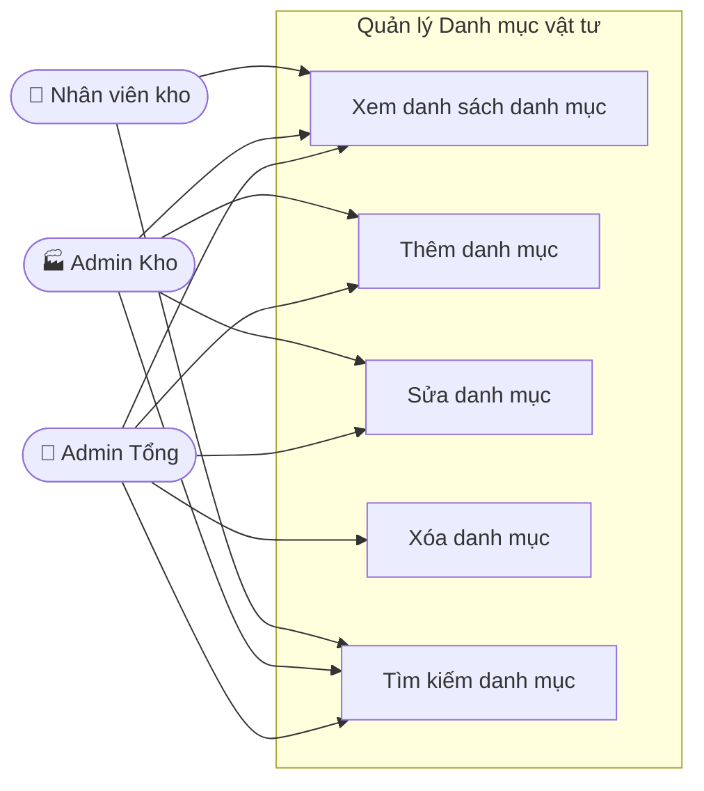
```mermaid
flowchart LR
    AdminTong(["👑 Admin Tổng"])
    AdminKho(["🏭 Admin Kho"])
    NhanVien(["👷 Nhân viên kho"])

    subgraph UC_DanhMuc [Quản lý Danh mục vật tư]
        UC1["Xem danh sách danh mục"]
        UC2["Thêm danh mục"]
        UC3["Sửa danh mục"]
        UC4["Xóa danh mục"]
        UC5["Tìm kiếm danh mục"]
    end

    AdminTong --> UC1 & UC2 & UC3 & UC4 & UC5
    AdminKho  --> UC1 & UC2 & UC3 & UC5
    NhanVien  --> UC1 & UC5
```

## 2.3.3. Quy trình quản lý Danh mục vật tư

### a) Thêm mới danh mục vật tư

| Mục | Nội dung |
|-----|----------|
| **Mục đích** | Thêm một danh mục vật tư vào hệ thống để phân loại và quản lý vật tư |
| **Các bước thực hiện** | 1. Quản trị viên chọn tính năng thêm mới danh mục vật tư. 2. Nhập các thông tin: Tên danh mục, mô tả, danh mục cha (nếu có). 3. Hệ thống kiểm tra tính hợp lệ: Tên danh mục không được trùng lặp. 4. Hệ thống lưu thông tin và cập nhật danh sách hiển thị. |
| **Tham chiếu** | Form thêm danh mục vật tư |

### b) Chỉnh sửa danh mục vật tư

| Mục | Nội dung |
|-----|----------|
| **Mục đích** | Chỉnh sửa thông tin danh mục vật tư để cập nhật dữ liệu chính xác |
| **Các bước thực hiện** | 1. Quản trị viên chọn danh mục cần chỉnh sửa. 2. Thực hiện chỉnh sửa: Tên danh mục, mô tả, danh mục cha. 3. Hệ thống kiểm tra tính hợp lệ. 4. Hệ thống lưu và làm mới danh sách. |
| **Tham chiếu** | Form chỉnh sửa danh mục |

### c) Xóa danh mục vật tư

| Mục | Nội dung |
|-----|----------|
| **Mục đích** | Xóa danh mục không còn sử dụng để duy trì cơ sở dữ liệu gọn gàng |
| **Các bước thực hiện** | 1. Quản trị viên chọn danh mục cần xóa. 2. Hệ thống yêu cầu xác nhận. 3. Kiểm tra xem danh mục có chứa vật tư nào không. 4. Nếu không có liên kết, tiến hành xóa và cập nhật danh sách. 5. Nếu có liên kết, thông báo không thể xóa. |
| **Tham chiếu** | Danh sách danh mục vật tư |

## 2.3.4. Thiết kế quy trình nghiệp vụ

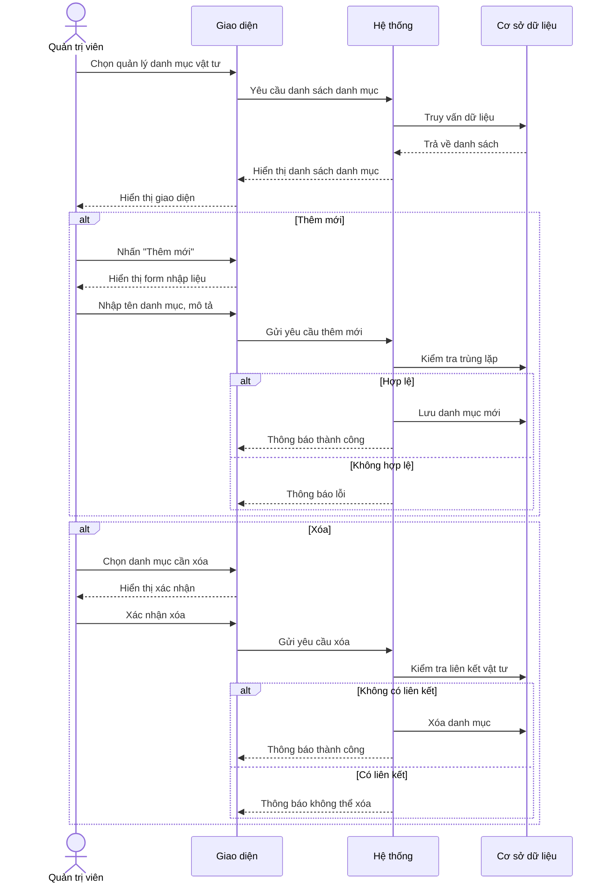
```mermaid
sequenceDiagram
    actor User as Quản trị viên
    participant UI as Giao diện
    participant Server as Hệ thống
    participant DB as Cơ sở dữ liệu

    User->>UI: Chọn quản lý danh mục vật tư
    UI->>Server: Yêu cầu danh sách danh mục
    Server->>DB: Truy vấn dữ liệu
    DB-->>Server: Trả về danh sách
    Server-->>UI: Hiển thị danh sách danh mục
    UI-->>User: Hiển thị giao diện

    alt Thêm mới
        User->>UI: Nhấn "Thêm mới"
        UI-->>User: Hiển thị form nhập liệu
        User->>UI: Nhập tên danh mục, mô tả
        UI->>Server: Gửi yêu cầu thêm mới
        Server->>DB: Kiểm tra trùng lặp
        alt Hợp lệ
            Server->>DB: Lưu danh mục mới
            Server-->>UI: Thông báo thành công
        else Không hợp lệ
            Server-->>UI: Thông báo lỗi
        end
    end

    alt Xóa
        User->>UI: Chọn danh mục cần xóa
        UI-->>User: Hiển thị xác nhận
        User->>UI: Xác nhận xóa
        UI->>Server: Gửi yêu cầu xóa
        Server->>DB: Kiểm tra liên kết vật tư
        alt Không có liên kết
            Server->>DB: Xóa danh mục
            Server-->>UI: Thông báo thành công
        else Có liên kết
            Server-->>UI: Thông báo không thể xóa
        end
    end
```

## 2.3.5. Thiết kế giao diện quản lý Danh mục vật tư

Giao diện quản lý danh mục vật tư gồm các phần chính: thanh điều hướng, danh sách danh mục dạng bảng với các cột mã, tên danh mục, mô tả và số lượng vật tư thuộc danh mục. Phần form thêm/sửa cho phép nhập tên danh mục và mô tả. Bộ lọc tìm kiếm hỗ trợ tra cứu nhanh theo tên. Giao diện giúp người dùng phân loại vật tư rõ ràng và hiệu quả.

*Hình 2.5. Giao diện quản lý Danh mục vật tư*

---

# 2.4. Module Quản lý Vật tư

## 2.4.1. Giới thiệu chức năng

Chức năng quản lý vật tư trong hệ thống được thiết kế nhằm hỗ trợ quản trị viên và nhân viên kho quản lý toàn bộ thông tin của từng loại vật tư một cách hiệu quả. Phạm vi công việc bao gồm phân tích dữ liệu vật tư, xây dựng bảng cơ sở dữ liệu lưu trữ thông tin vật tư, phát triển các tính năng thêm, sửa, xóa và cập nhật thông tin. Bên cạnh đó, hệ thống cho phép hiển thị danh sách vật tư theo nhiều tiêu chí như danh mục, đơn vị tính, nhà cung cấp, số lượng tồn kho hoặc giá, đồng thời đảm bảo khả năng truy cập và thao tác linh hoạt theo từng phân quyền của người dùng.

## 2.4.2. Tác nhân và biểu đồ ca sử dụng

- **Quản trị viên:** Quản lý toàn bộ thông tin vật tư, bao gồm thêm mới, chỉnh sửa, xóa, import/export danh sách và thiết lập mức tồn kho tối thiểu.
- **Nhân viên kho:** Xem danh sách vật tư, kiểm tra tồn kho, cập nhật thông tin vật tư khi nhập/xuất kho, đồng thời hỗ trợ chỉnh sửa nếu được phân quyền.
- **Nhân viên mua hàng:** Xem danh sách vật tư, tra cứu thông tin giá, nhà cung cấp để lập đơn đặt hàng.

### Biểu đồ Use Case - Quản lý Vật tư

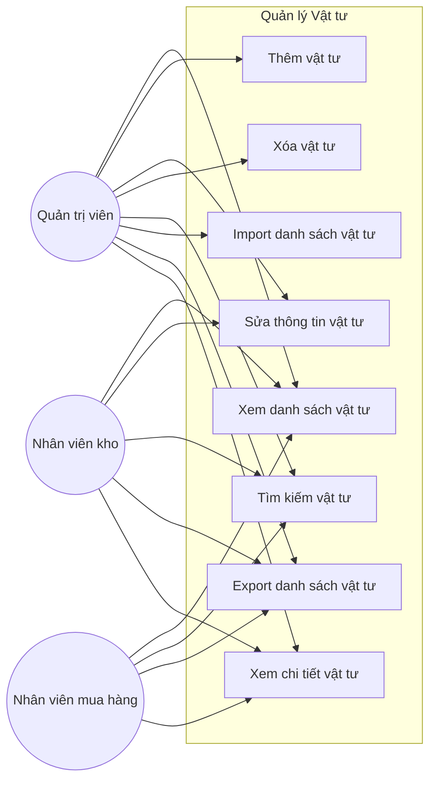
```mermaid
graph LR
    Admin((Quản trị viên))
    NVKho((Nhân viên kho))
    NVMua((Nhân viên mua hàng))

    subgraph UC_VatTu [Quản lý Vật tư]
        UC1[Xem danh sách vật tư]
        UC2[Thêm vật tư]
        UC3[Sửa thông tin vật tư]
        UC4[Xóa vật tư]
        UC5[Tìm kiếm vật tư]
        UC6[Import danh sách vật tư]
        UC7[Export danh sách vật tư]
        UC8[Xem chi tiết vật tư]
    end

    Admin --> UC1
    Admin --> UC2
    Admin --> UC3
    Admin --> UC4
    Admin --> UC5
    Admin --> UC6
    Admin --> UC7
    Admin --> UC8

    NVKho --> UC1
    NVKho --> UC3
    NVKho --> UC5
    NVKho --> UC7
    NVKho --> UC8

    NVMua --> UC1
    NVMua --> UC5
    NVMua --> UC7
    NVMua --> UC8
```

## 2.4.3. Quy trình quản lý Vật tư

### a) Thêm mới vật tư

| Mục | Nội dung |
|-----|----------|
| **Mục đích** | Thêm một vật tư mới vào hệ thống để quản lý và theo dõi tồn kho |
| **Các bước thực hiện** | 1. Quản trị viên/nhân viên chọn tính năng thêm mới vật tư. 2. Nhập các thông tin: Mã vật tư, tên vật tư, danh mục, đơn vị tính, nhà cung cấp, giá nhập, giá xuất, mức tồn kho tối thiểu, mô tả. 3. Hệ thống kiểm tra tính hợp lệ: Mã vật tư không được trùng lặp. 4. Hệ thống lưu thông tin và cập nhật danh sách hiển thị. |
| **Tham chiếu** | Form thêm vật tư |

### b) Chỉnh sửa thông tin vật tư

| Mục | Nội dung |
|-----|----------|
| **Mục đích** | Chỉnh sửa thông tin vật tư để cập nhật dữ liệu chính xác |
| **Các bước thực hiện** | 1. Quản trị viên/nhân viên chọn vật tư cần chỉnh sửa. 2. Thực hiện chỉnh sửa các thông tin: Tên, danh mục, đơn vị tính, nhà cung cấp, giá, mức tồn kho tối thiểu. 3. Hệ thống kiểm tra tính hợp lệ. 4. Hệ thống lưu và làm mới danh sách. |
| **Tham chiếu** | Form chỉnh sửa vật tư |

### c) Xóa vật tư

| Mục | Nội dung |
|-----|----------|
| **Mục đích** | Xóa vật tư không còn sử dụng để duy trì cơ sở dữ liệu sạch |
| **Các bước thực hiện** | 1. Quản trị viên chọn vật tư cần xóa. 2. Hệ thống yêu cầu xác nhận. 3. Kiểm tra xem vật tư có liên kết với phiếu nhập/xuất kho không. 4. Nếu không có liên kết, tiến hành xóa. 5. Nếu có liên kết, thông báo không thể xóa. |
| **Tham chiếu** | Danh sách vật tư |

## 2.4.4. Thiết kế quy trình nghiệp vụ

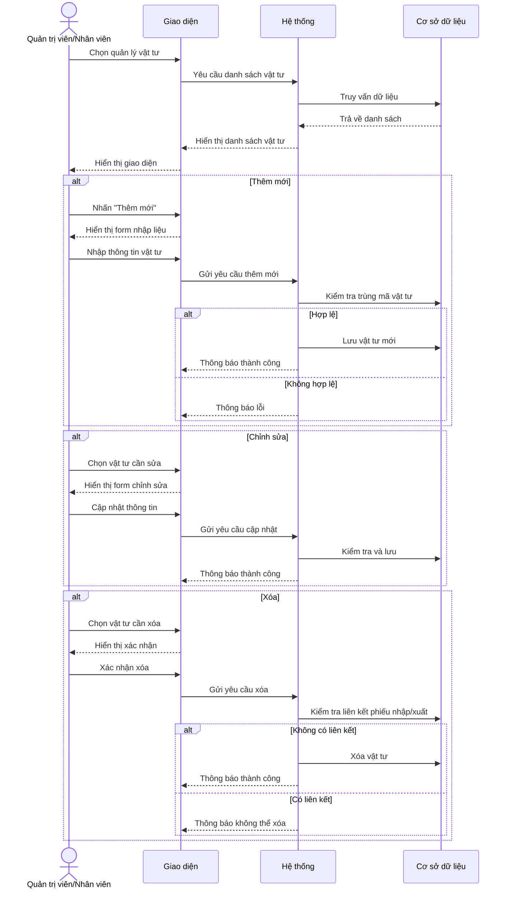
```mermaid
sequenceDiagram
    actor User as Quản trị viên/Nhân viên
    participant UI as Giao diện
    participant Server as Hệ thống
    participant DB as Cơ sở dữ liệu

    User->>UI: Chọn quản lý vật tư
    UI->>Server: Yêu cầu danh sách vật tư
    Server->>DB: Truy vấn dữ liệu
    DB-->>Server: Trả về danh sách
    Server-->>UI: Hiển thị danh sách vật tư
    UI-->>User: Hiển thị giao diện

    alt Thêm mới
        User->>UI: Nhấn "Thêm mới"
        UI-->>User: Hiển thị form nhập liệu
        User->>UI: Nhập thông tin vật tư
        UI->>Server: Gửi yêu cầu thêm mới
        Server->>DB: Kiểm tra trùng mã vật tư
        alt Hợp lệ
            Server->>DB: Lưu vật tư mới
            Server-->>UI: Thông báo thành công
        else Không hợp lệ
            Server-->>UI: Thông báo lỗi
        end
    end

    alt Chỉnh sửa
        User->>UI: Chọn vật tư cần sửa
        UI-->>User: Hiển thị form chỉnh sửa
        User->>UI: Cập nhật thông tin
        UI->>Server: Gửi yêu cầu cập nhật
        Server->>DB: Kiểm tra và lưu
        Server-->>UI: Thông báo thành công
    end

    alt Xóa
        User->>UI: Chọn vật tư cần xóa
        UI-->>User: Hiển thị xác nhận
        User->>UI: Xác nhận xóa
        UI->>Server: Gửi yêu cầu xóa
        Server->>DB: Kiểm tra liên kết phiếu nhập/xuất
        alt Không có liên kết
            Server->>DB: Xóa vật tư
            Server-->>UI: Thông báo thành công
        else Có liên kết
            Server-->>UI: Thông báo không thể xóa
        end
    end
```

## 2.4.5. Thiết kế giao diện quản lý Vật tư

Giao diện quản lý vật tư gồm các phần chính: thanh điều hướng, danh sách vật tư dạng bảng với các cột mã, tên, danh mục, đơn vị tính, nhà cung cấp, giá nhập, giá xuất, tồn kho. Form thêm/sửa cho phép nhập đầy đủ thông tin vật tư. Bộ lọc tìm kiếm hỗ trợ tra cứu theo tên, danh mục, nhà cung cấp. Nút import/export cho phép nhập xuất dữ liệu hàng loạt.

*Hình 2.6. Giao diện quản lý Vật tư*

---

# 2.5. Module Quản lý Kho

## 2.5.1. Giới thiệu chức năng

Chức năng quản lý kho trong hệ thống quản lý vật tư được thiết kế nhằm hỗ trợ quản trị viên và nhân viên kho quản lý toàn bộ thông tin các kho hàng một cách hiệu quả. Phạm vi công việc bao gồm quản lý thông tin kho (tên kho, địa chỉ, người phụ trách), theo dõi vật tư trong từng kho, hỗ trợ điều chuyển vật tư giữa các kho và kiểm kê định kỳ. Hệ thống đảm bảo khả năng truy cập và thao tác linh hoạt theo từng phân quyền của người dùng.

## 2.5.2. Tác nhân và biểu đồ ca sử dụng

- **Quản trị viên:** Quản lý toàn bộ thông tin kho, bao gồm thêm mới kho, chỉnh sửa, xóa, phân công người phụ trách và xem báo cáo tồn kho.
- **Nhân viên kho:** Xem danh sách kho, xem tồn kho theo từng kho, thực hiện kiểm kê và điều chuyển vật tư giữa các kho.

### Biểu đồ Use Case - Quản lý Kho

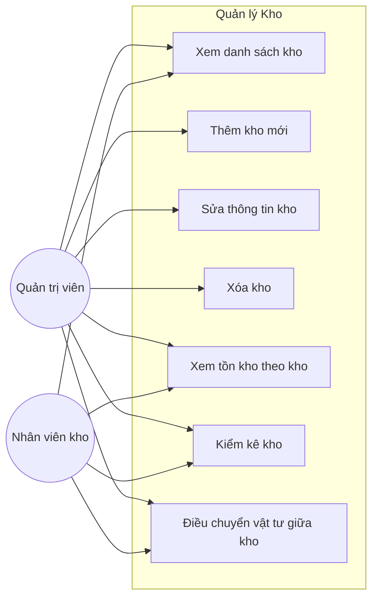
```mermaid
graph LR
    Admin((Quản trị viên))
    NVKho((Nhân viên kho))

    subgraph UC_Kho [Quản lý Kho]
        UC1[Xem danh sách kho]
        UC2[Thêm kho mới]
        UC3[Sửa thông tin kho]
        UC4[Xóa kho]
        UC5[Xem tồn kho theo kho]
        UC6[Kiểm kê kho]
        UC7[Điều chuyển vật tư giữa kho]
    end

    Admin --> UC1
    Admin --> UC2
    Admin --> UC3
    Admin --> UC4
    Admin --> UC5
    Admin --> UC6
    Admin --> UC7

    NVKho --> UC1
    NVKho --> UC5
    NVKho --> UC6
    NVKho --> UC7
```

## 2.5.3. Quy trình quản lý Kho

### a) Thêm mới kho

| Mục | Nội dung |
|-----|----------|
| **Mục đích** | Thêm một kho mới vào hệ thống khi doanh nghiệp mở rộng |
| **Các bước thực hiện** | 1. Quản trị viên chọn tính năng thêm mới kho. 2. Nhập các thông tin: Mã kho, tên kho, địa chỉ, người phụ trách. 3. Hệ thống kiểm tra tính hợp lệ: Mã kho không được trùng. 4. Hệ thống lưu thông tin và cập nhật danh sách. |
| **Tham chiếu** | Form thêm kho |

### b) Kiểm kê kho

| Mục | Nội dung |
|-----|----------|
| **Mục đích** | Đối chiếu số lượng thực tế với số liệu trên hệ thống để phát hiện chênh lệch |
| **Các bước thực hiện** | 1. Nhân viên kho chọn kho cần kiểm kê. 2. Hệ thống hiển thị danh sách vật tư trong kho với số lượng hệ thống. 3. Nhân viên nhập số lượng thực tế kiểm đếm được. 4. Hệ thống tính toán chênh lệch. 5. Lưu phiếu kiểm kê và cập nhật tồn kho nếu được duyệt. |
| **Tham chiếu** | Phiếu . Module Kiểm kê kho |

### c) Điều chuyển vật tư giữa kho

| Mục | Nội dung |
|-----|----------|
| **Mục đích** | Chuyển vật tư từ kho này sang kho khác để cân đối tồn kho |
| **Các bước thực hiện** | 1. Nhân viên kho chọn tính năng điều chuyển. 2. Chọn kho nguồn, kho đích, vật tư và số lượng cần chuyển. 3. Hệ thống kiểm tra tồn kho kho nguồn đủ số lượng. 4. Tạo phiếu điều chuyển và cập nhật tồn kho cả hai kho. |
| **Tham chiếu** | Phiếu điều chuyển kho |

## 2.5.4. Thiết kế quy trình nghiệp vụ

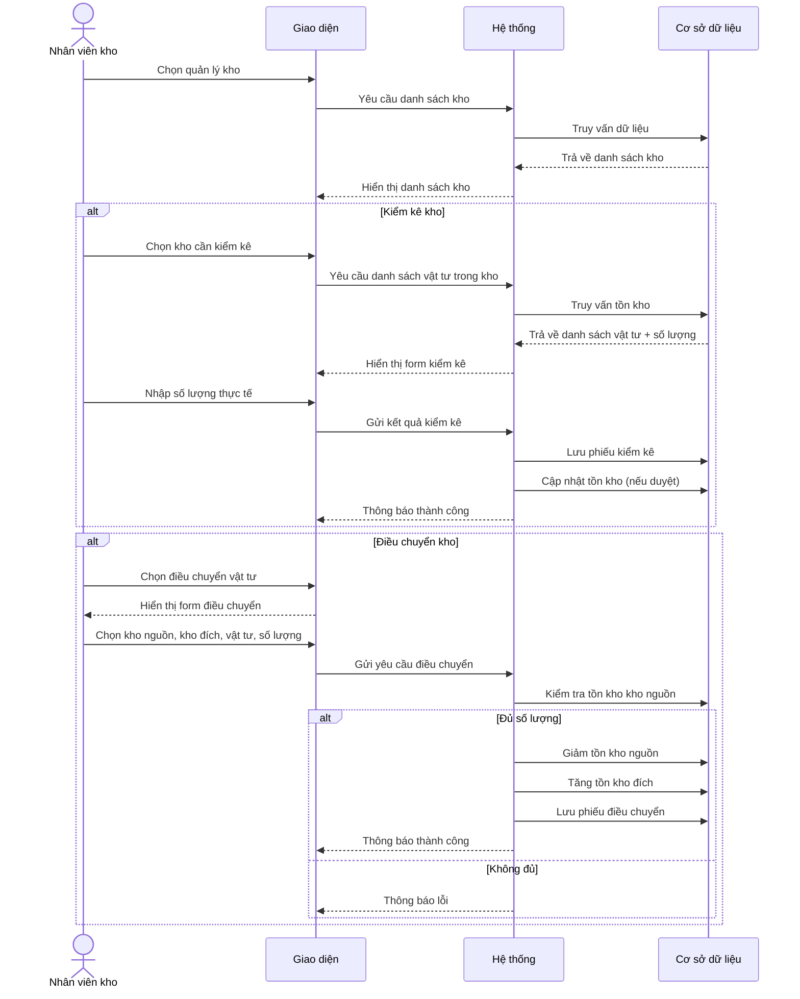
```mermaid
sequenceDiagram
    actor User as Nhân viên kho
    participant UI as Giao diện
    participant Server as Hệ thống
    participant DB as Cơ sở dữ liệu

    User->>UI: Chọn quản lý kho
    UI->>Server: Yêu cầu danh sách kho
    Server->>DB: Truy vấn dữ liệu
    DB-->>Server: Trả về danh sách kho
    Server-->>UI: Hiển thị danh sách kho

    alt Kiểm kê kho
        User->>UI: Chọn kho cần kiểm kê
        UI->>Server: Yêu cầu danh sách vật tư trong kho
        Server->>DB: Truy vấn tồn kho
        DB-->>Server: Trả về danh sách vật tư + số lượng
        Server-->>UI: Hiển thị form kiểm kê
        User->>UI: Nhập số lượng thực tế
        UI->>Server: Gửi kết quả kiểm kê
        Server->>DB: Lưu phiếu kiểm kê
        Server->>DB: Cập nhật tồn kho (nếu duyệt)
        Server-->>UI: Thông báo thành công
    end

    alt Điều chuyển kho
        User->>UI: Chọn điều chuyển vật tư
        UI-->>User: Hiển thị form điều chuyển
        User->>UI: Chọn kho nguồn, kho đích, vật tư, số lượng
        UI->>Server: Gửi yêu cầu điều chuyển
        Server->>DB: Kiểm tra tồn kho kho nguồn
        alt Đủ số lượng
            Server->>DB: Giảm tồn kho nguồn
            Server->>DB: Tăng tồn kho đích
            Server->>DB: Lưu phiếu điều chuyển
            Server-->>UI: Thông báo thành công
        else Không đủ
            Server-->>UI: Thông báo lỗi
        end
    end
```

## 2.5.5. Thiết kế giao diện quản lý Kho

Giao diện quản lý kho gồm các phần chính: danh sách kho dạng bảng với các cột mã kho, tên kho, địa chỉ, người phụ trách. Phần xem tồn kho hiển thị chi tiết vật tư trong từng kho. Form kiểm kê cho phép nhập số lượng thực tế. Form điều chuyển cho phép chọn kho nguồn, kho đích và vật tư cần chuyển.

*Hình 2.7. Giao diện quản lý Kho*

---

# 2.6. Module Quản lý Nhập xuất kho

## 2.6.1. Giới thiệu chức năng

Chức năng quản lý nhập xuất kho trong hệ thống quản lý vật tư được thiết kế nhằm hỗ trợ quản trị viên và nhân viên kho theo dõi và xử lý các phiếu nhập kho, phiếu xuất kho một cách hiệu quả. Phạm vi công việc bao gồm tạo phiếu nhập/xuất, duyệt phiếu, cập nhật tồn kho tự động, theo dõi lịch sử giao dịch và xuất báo cáo nhập xuất. Hệ thống đảm bảo tính chính xác của dữ liệu tồn kho sau mỗi giao dịch.

## 2.6.2. Tác nhân và biểu đồ ca sử dụng

- **Quản trị viên:** Duyệt phiếu nhập/xuất, xem toàn bộ lịch sử nhập xuất, hủy phiếu và xuất báo cáo.
- **Nhân viên kho:** Tạo phiếu nhập kho, tạo phiếu xuất kho, xem danh sách phiếu, in phiếu và theo dõi trạng thái phiếu.
- **Nhân viên mua hàng:** Tạo phiếu nhập kho từ đơn đặt hàng, xem lịch sử nhập hàng.

### Biểu đồ Use Case - Quản lý Nhập xuất kho

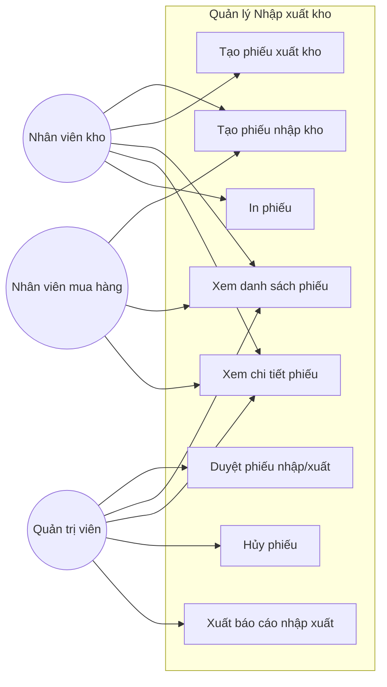
```mermaid
graph LR
    Admin((Quản trị viên))
    NVKho((Nhân viên kho))
    NVMua((Nhân viên mua hàng))

    subgraph UC_NhapXuat [Quản lý Nhập xuất kho]
        UC1[Tạo phiếu nhập kho]
        UC2[Tạo phiếu xuất kho]
        UC3[Duyệt phiếu nhập/xuất]
        UC4[Xem danh sách phiếu]
        UC5[Xem chi tiết phiếu]
        UC6[Hủy phiếu]
        UC7[In phiếu]
        UC8[Xuất báo cáo nhập xuất]
    end

    Admin --> UC3
    Admin --> UC4
    Admin --> UC5
    Admin --> UC6
    Admin --> UC8

    NVKho --> UC1
    NVKho --> UC2
    NVKho --> UC4
    NVKho --> UC5
    NVKho --> UC7

    NVMua --> UC1
    NVMua --> UC4
    NVMua --> UC5
```

## 2.6.3. Quy trình quản lý Nhập xuất kho

### a) Tạo phiếu nhập kho

| Mục | Nội dung |
|-----|----------|
| **Mục đích** | Ghi nhận vật tư nhập vào kho từ nhà cung cấp hoặc điều chuyển |
| **Các bước thực hiện** | 1. Nhân viên kho chọn tính năng tạo phiếu nhập kho. 2. Chọn kho nhập, nhà cung cấp, ngày nhập. 3. Thêm chi tiết vật tư: Chọn vật tư, nhập số lượng, đơn giá. 4. Hệ thống tính tổng tiền tự động. 5. Lưu phiếu nhập (trạng thái chờ duyệt). 6. Sau khi được duyệt, hệ thống tự động cập nhật tồn kho. |
| **Tham chiếu** | Form tạo phiếu nhập kho |

### b) Tạo phiếu xuất kho

| Mục | Nội dung |
|-----|----------|
| **Mục đích** | Ghi nhận vật tư xuất ra khỏi kho cho dự án hoặc bộ phận sử dụng |
| **Các bước thực hiện** | 1. Nhân viên kho chọn tính năng tạo phiếu xuất kho. 2. Chọn kho xuất, dự án/bộ phận nhận, ngày xuất. 3. Thêm chi tiết vật tư: Chọn vật tư, nhập số lượng xuất. 4. Hệ thống kiểm tra tồn kho đủ số lượng. 5. Lưu phiếu xuất (trạng thái chờ duyệt). 6. Sau khi được duyệt, hệ thống tự động giảm tồn kho. |
| **Tham chiếu** | Form tạo phiếu xuất kho |

### c) Duyệt phiếu nhập/xuất

| Mục | Nội dung |
|-----|----------|
| **Mục đích** | Xác nhận tính hợp lệ của phiếu trước khi cập nhật tồn kho |
| **Các bước thực hiện** | 1. Quản trị viên xem danh sách phiếu chờ duyệt. 2. Chọn phiếu cần duyệt, xem chi tiết. 3. Xác nhận duyệt hoặc từ chối. 4. Nếu duyệt: Hệ thống cập nhật tồn kho tự động. 5. Nếu từ chối: Ghi lý do và trả phiếu về người tạo. |
| **Tham chiếu** | Danh sách phiếu chờ duyệt |

## 2.6.4. Thiết kế quy trình nghiệp vụ

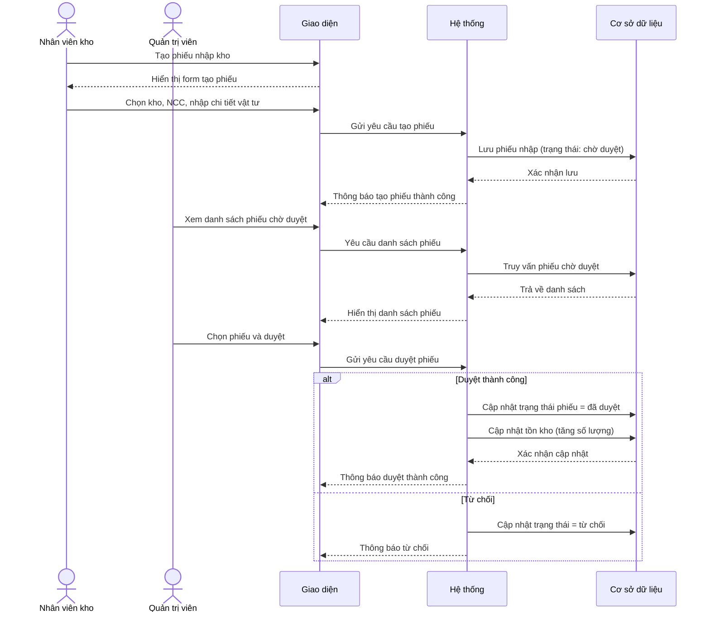
```mermaid
sequenceDiagram
    actor NVKho as Nhân viên kho
    actor Admin as Quản trị viên
    participant UI as Giao diện
    participant Server as Hệ thống
    participant DB as Cơ sở dữ liệu

    NVKho->>UI: Tạo phiếu nhập kho
    UI-->>NVKho: Hiển thị form tạo phiếu
    NVKho->>UI: Chọn kho, NCC, nhập chi tiết vật tư
    UI->>Server: Gửi yêu cầu tạo phiếu
    Server->>DB: Lưu phiếu nhập (trạng thái: chờ duyệt)
    DB-->>Server: Xác nhận lưu
    Server-->>UI: Thông báo tạo phiếu thành công

    Admin->>UI: Xem danh sách phiếu chờ duyệt
    UI->>Server: Yêu cầu danh sách phiếu
    Server->>DB: Truy vấn phiếu chờ duyệt
    DB-->>Server: Trả về danh sách
    Server-->>UI: Hiển thị danh sách phiếu

    Admin->>UI: Chọn phiếu và duyệt
    UI->>Server: Gửi yêu cầu duyệt phiếu
    alt Duyệt thành công
        Server->>DB: Cập nhật trạng thái phiếu = đã duyệt
        Server->>DB: Cập nhật tồn kho (tăng số lượng)
        DB-->>Server: Xác nhận cập nhật
        Server-->>UI: Thông báo duyệt thành công
    else Từ chối
        Server->>DB: Cập nhật trạng thái = từ chối
        Server-->>UI: Thông báo từ chối
    end
```

## 2.6.5. Thiết kế giao diện quản lý Nhập xuất kho

Giao diện quản lý nhập xuất kho gồm các phần chính: danh sách phiếu nhập/xuất dạng bảng với các cột mã phiếu, loại phiếu, kho, nhà cung cấp/dự án, ngày tạo, trạng thái, tổng tiền. Form tạo phiếu cho phép chọn kho, nhà cung cấp và thêm nhiều dòng chi tiết vật tư. Bộ lọc theo loại phiếu, trạng thái, khoảng thời gian. Nút duyệt/từ chối cho quản trị viên.

*Hình 2.8. Giao diện quản lý Nhập xuất kho*

---

# 2.7. Module Quản lý Nhân viên

## 2.7.1. Giới thiệu chức năng

Chức năng quản lý nhân viên trong hệ thống quản lý vật tư được thiết kế nhằm hỗ trợ quản trị viên lưu trữ thông tin nhân sự, phân quyền theo vai trò và theo dõi hoạt động làm việc. Phạm vi công việc bao gồm quản lý tài khoản người dùng, phân vai trò (quản trị viên, nhân viên kho, nhân viên mua hàng), thiết lập quyền hạn truy cập và theo dõi lịch sử hoạt động.

## 2.7.2. Tác nhân và biểu đồ ca sử dụng

- **Quản trị viên:** Quản lý toàn bộ tài khoản nhân viên, bao gồm thêm mới, chỉnh sửa, khóa/mở khóa tài khoản, phân quyền và xem lịch sử hoạt động.

### Biểu đồ Use Case - Quản lý Nhân viên

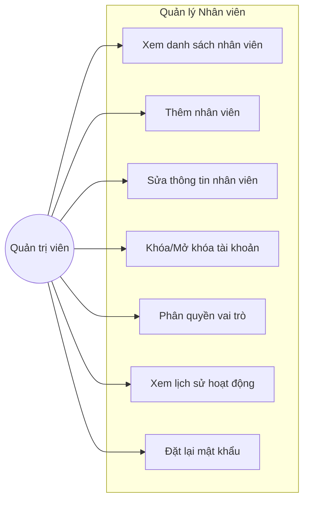
```mermaid
graph LR
    Admin((Quản trị viên))

    subgraph UC_NhanVien [Quản lý Nhân viên]
        UC1[Xem danh sách nhân viên]
        UC2[Thêm nhân viên]
        UC3[Sửa thông tin nhân viên]
        UC4[Khóa/Mở khóa tài khoản]
        UC5[Phân quyền vai trò]
        UC6[Xem lịch sử hoạt động]
        UC7[Đặt lại mật khẩu]
    end

    Admin --> UC1
    Admin --> UC2
    Admin --> UC3
    Admin --> UC4
    Admin --> UC5
    Admin --> UC6
    Admin --> UC7
```

## 2.7.3. Quy trình quản lý Nhân viên

### a) Thêm mới nhân viên

| Mục | Nội dung |
|-----|----------|
| **Mục đích** | Tạo tài khoản cho nhân viên mới để truy cập hệ thống |
| **Các bước thực hiện** | 1. Quản trị viên chọn tính năng thêm nhân viên. 2. Nhập thông tin: Họ tên, email, số điện thoại, vai trò, mật khẩu. 3. Hệ thống kiểm tra email không trùng lặp. 4. Lưu tài khoản và gửi thông tin đăng nhập cho nhân viên. |
| **Tham chiếu** | Form thêm nhân viên |

### b) Phân quyền vai trò

| Mục | Nội dung |
|-----|----------|
| **Mục đích** | Gán vai trò và quyền hạn phù hợp cho từng nhân viên |
| **Các bước thực hiện** | 1. Quản trị viên chọn nhân viên cần phân quyền. 2. Chọn vai trò: Quản trị viên, Nhân viên kho, Nhân viên mua hàng. 3. Tùy chỉnh quyền hạn chi tiết (nếu cần). 4. Hệ thống lưu và áp dụng quyền mới ngay lập tức. |
| **Tham chiếu** | Form phân quyền |

### c) Khóa/Mở khóa tài khoản

| Mục | Nội dung |
|-----|----------|
| **Mục đích** | Vô hiệu hóa hoặc kích hoạt lại tài khoản nhân viên |
| **Các bước thực hiện** | 1. Quản trị viên chọn nhân viên cần khóa/mở khóa. 2. Xác nhận thao tác. 3. Hệ thống cập nhật trạng thái tài khoản. 4. Nhân viên bị khóa sẽ không thể đăng nhập hệ thống. |
| **Tham chiếu** | Danh sách nhân viên |

## 2.7.4. Thiết kế quy trình nghiệp vụ

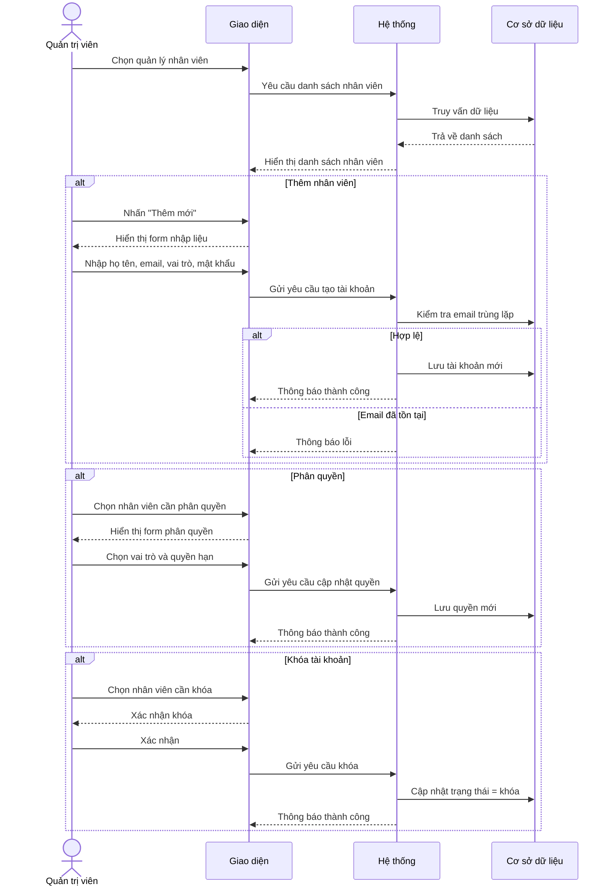
```mermaid
sequenceDiagram
    actor Admin as Quản trị viên
    participant UI as Giao diện
    participant Server as Hệ thống
    participant DB as Cơ sở dữ liệu

    Admin->>UI: Chọn quản lý nhân viên
    UI->>Server: Yêu cầu danh sách nhân viên
    Server->>DB: Truy vấn dữ liệu
    DB-->>Server: Trả về danh sách
    Server-->>UI: Hiển thị danh sách nhân viên

    alt Thêm nhân viên
        Admin->>UI: Nhấn "Thêm mới"
        UI-->>Admin: Hiển thị form nhập liệu
        Admin->>UI: Nhập họ tên, email, vai trò, mật khẩu
        UI->>Server: Gửi yêu cầu tạo tài khoản
        Server->>DB: Kiểm tra email trùng lặp
        alt Hợp lệ
            Server->>DB: Lưu tài khoản mới
            Server-->>UI: Thông báo thành công
        else Email đã tồn tại
            Server-->>UI: Thông báo lỗi
        end
    end

    alt Phân quyền
        Admin->>UI: Chọn nhân viên cần phân quyền
        UI-->>Admin: Hiển thị form phân quyền
        Admin->>UI: Chọn vai trò và quyền hạn
        UI->>Server: Gửi yêu cầu cập nhật quyền
        Server->>DB: Lưu quyền mới
        Server-->>UI: Thông báo thành công
    end

    alt Khóa tài khoản
        Admin->>UI: Chọn nhân viên cần khóa
        UI-->>Admin: Xác nhận khóa
        Admin->>UI: Xác nhận
        UI->>Server: Gửi yêu cầu khóa
        Server->>DB: Cập nhật trạng thái = khóa
        Server-->>UI: Thông báo thành công
    end
```

## 2.7.5. Thiết kế giao diện quản lý Nhân viên

Giao diện quản lý nhân viên gồm các phần chính: danh sách nhân viên dạng bảng với các cột họ tên, email, số điện thoại, vai trò, trạng thái. Form thêm/sửa cho phép nhập thông tin nhân viên và chọn vai trò. Phần phân quyền hiển thị danh sách quyền hạn theo từng module. Bộ lọc theo vai trò và trạng thái.

*Hình 2.9. Giao diện quản lý Nhân viên*

---

# 2.8. Module Quản lý Báo cáo thống kê

## 2.8.1. Giới thiệu chức năng

Chức năng quản lý báo cáo thống kê trong hệ thống quản lý vật tư được thiết kế nhằm hỗ trợ ban lãnh đạo và quản trị viên tổng hợp dữ liệu về nhập xuất kho, tồn kho, chi phí mua hàng và vật tư sử dụng nhiều. Phạm vi công việc bao gồm tạo báo cáo tồn kho, báo cáo nhập xuất theo thời gian, báo cáo chi phí và biểu đồ trực quan. Hệ thống hỗ trợ xuất báo cáo dưới dạng Excel/PDF.

## 2.8.2. Tác nhân và biểu đồ ca sử dụng

- **Quản trị viên:** Xem toàn bộ báo cáo, tùy chỉnh khoảng thời gian, xuất báo cáo và xem biểu đồ thống kê.
- **Nhân viên kho:** Xem báo cáo tồn kho, báo cáo nhập xuất của kho mình phụ trách.

### Biểu đồ Use Case - Quản lý Báo cáo

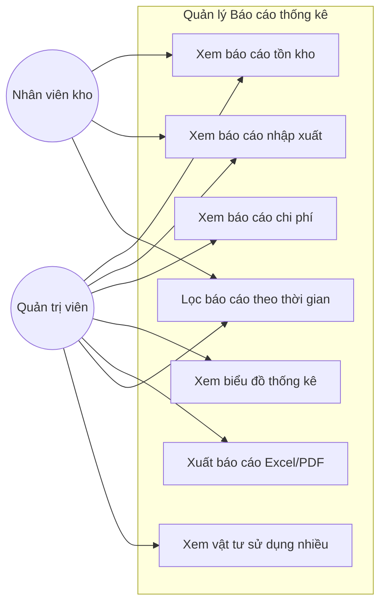
```mermaid
graph LR
    Admin((Quản trị viên))
    NVKho((Nhân viên kho))

    subgraph UC_BaoCao [Quản lý Báo cáo thống kê]
        UC1[Xem báo cáo tồn kho]
        UC2[Xem báo cáo nhập xuất]
        UC3[Xem báo cáo chi phí]
        UC4[Xem biểu đồ thống kê]
        UC5[Xuất báo cáo Excel/PDF]
        UC6[Lọc báo cáo theo thời gian]
        UC7[Xem vật tư sử dụng nhiều]
    end

    Admin --> UC1
    Admin --> UC2
    Admin --> UC3
    Admin --> UC4
    Admin --> UC5
    Admin --> UC6
    Admin --> UC7

    NVKho --> UC1
    NVKho --> UC2
    NVKho --> UC6
```

## 2.8.3. Quy trình quản lý Báo cáo

### a) Xem báo cáo tồn kho

| Mục | Nội dung |
|-----|----------|
| **Mục đích** | Theo dõi số lượng vật tư hiện có trong từng kho |
| **Các bước thực hiện** | 1. Người dùng chọn báo cáo tồn kho. 2. Chọn kho cần xem (hoặc tất cả kho). 3. Hệ thống tổng hợp dữ liệu tồn kho. 4. Hiển thị bảng tồn kho với cảnh báo vật tư dưới mức tối thiểu. 5. Cho phép xuất báo cáo Excel/PDF. |
| **Tham chiếu** | Trang báo cáo tồn kho |

### b) Xem báo cáo nhập xuất

| Mục | Nội dung |
|-----|----------|
| **Mục đích** | Thống kê số lượng và giá trị nhập xuất theo khoảng thời gian |
| **Các bước thực hiện** | 1. Người dùng chọn báo cáo nhập xuất. 2. Chọn khoảng thời gian (ngày, tuần, tháng, năm). 3. Chọn kho hoặc nhà cung cấp cần lọc. 4. Hệ thống tổng hợp và hiển thị dữ liệu. 5. Hiển thị biểu đồ xu hướng nhập xuất. |
| **Tham chiếu** | Trang báo cáo nhập xuất |

### c) Xem báo cáo chi phí

| Mục | Nội dung |
|-----|----------|
| **Mục đích** | Đánh giá chi phí mua vật tư theo thời gian và nhà cung cấp |
| **Các bước thực hiện** | 1. Quản trị viên chọn báo cáo chi phí. 2. Chọn khoảng thời gian và tiêu chí lọc. 3. Hệ thống tổng hợp chi phí theo nhà cung cấp, danh mục vật tư. 4. Hiển thị biểu đồ so sánh chi phí. |
| **Tham chiếu** | Trang báo cáo chi phí |

## 2.8.4. Thiết kế quy trình nghiệp vụ

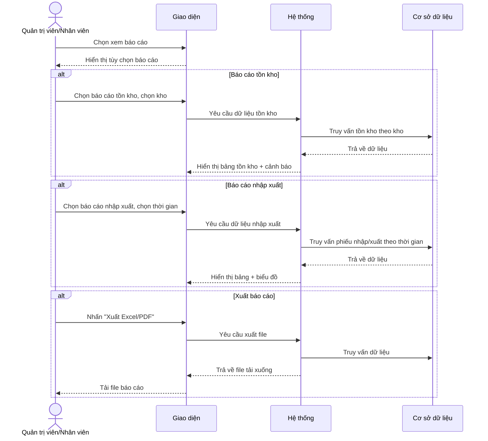
```mermaid
sequenceDiagram
    actor User as Quản trị viên/Nhân viên
    participant UI as Giao diện
    participant Server as Hệ thống
    participant DB as Cơ sở dữ liệu

    User->>UI: Chọn xem báo cáo
    UI-->>User: Hiển thị tùy chọn báo cáo

    alt Báo cáo tồn kho
        User->>UI: Chọn báo cáo tồn kho, chọn kho
        UI->>Server: Yêu cầu dữ liệu tồn kho
        Server->>DB: Truy vấn tồn kho theo kho
        DB-->>Server: Trả về dữ liệu
        Server-->>UI: Hiển thị bảng tồn kho + cảnh báo
    end

    alt Báo cáo nhập xuất
        User->>UI: Chọn báo cáo nhập xuất, chọn thời gian
        UI->>Server: Yêu cầu dữ liệu nhập xuất
        Server->>DB: Truy vấn phiếu nhập/xuất theo thời gian
        DB-->>Server: Trả về dữ liệu
        Server-->>UI: Hiển thị bảng + biểu đồ
    end

    alt Xuất báo cáo
        User->>UI: Nhấn "Xuất Excel/PDF"
        UI->>Server: Yêu cầu xuất file
        Server->>DB: Truy vấn dữ liệu
        Server-->>UI: Trả về file tải xuống
        UI-->>User: Tải file báo cáo
    end
```

## 2.8.5. Thiết kế giao diện quản lý Báo cáo

Giao diện báo cáo gồm các phần chính: bộ lọc thời gian và tiêu chí, bảng dữ liệu thống kê, biểu đồ trực quan (cột, đường, tròn), nút xuất báo cáo Excel/PDF. Dashboard tổng quan hiển thị các chỉ số quan trọng: tổng giá trị tồn kho, số phiếu nhập/xuất trong tháng, vật tư cần nhập thêm.

*Hình 2.10. Giao diện quản lý Báo cáo thống kê*

---

# 2.9. Module Đăng nhập, Đăng ký

## 2.9.1. Giới thiệu chức năng

Chức năng đăng nhập – đăng ký trong hệ thống quản lý vật tư được thiết kế nhằm cho phép người dùng tạo tài khoản và truy cập hệ thống theo đúng quyền hạn. Phạm vi công việc bao gồm xác thực người dùng, quản lý phiên đăng nhập, khôi phục mật khẩu và đảm bảo bảo mật thông tin. Hệ thống phân biệt vai trò người dùng như quản trị viên, nhân viên kho hay nhân viên mua hàng, đảm bảo sử dụng an toàn và hiệu quả.

## 2.9.2. Tác nhân và biểu đồ ca sử dụng

- **Người dùng (chưa đăng nhập):** Đăng nhập, đăng ký tài khoản, quên mật khẩu.
- **Người dùng (đã đăng nhập):** Đổi mật khẩu, cập nhật thông tin cá nhân, đăng xuất.

### Biểu đồ Use Case - Đăng nhập, Đăng ký

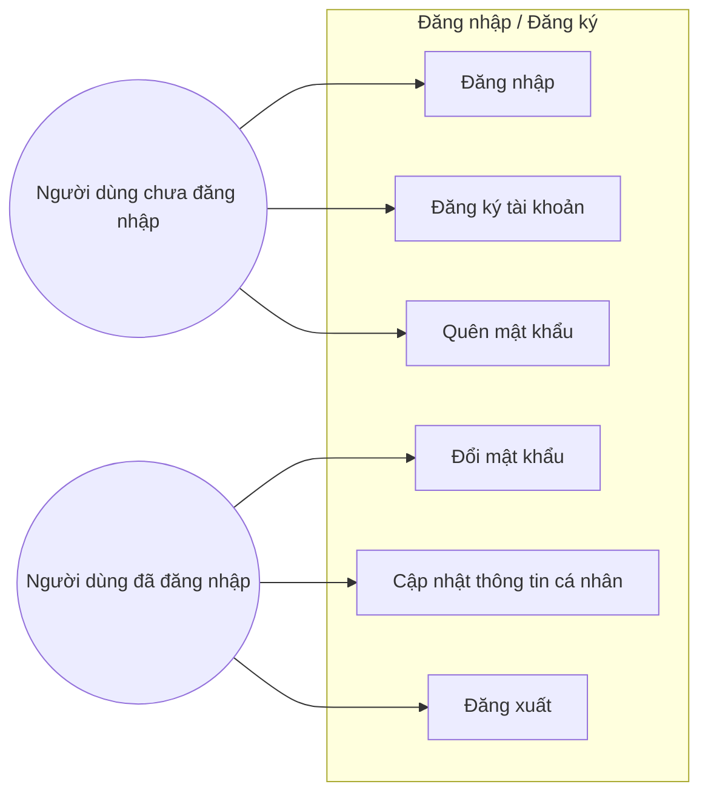
```mermaid
graph LR
    Guest((Người dùng chưa đăng nhập))
    LoggedIn((Người dùng đã đăng nhập))

    subgraph UC_Auth [Đăng nhập / Đăng ký]
        UC1[Đăng nhập]
        UC2[Đăng ký tài khoản]
        UC3[Quên mật khẩu]
        UC4[Đổi mật khẩu]
        UC5[Cập nhật thông tin cá nhân]
        UC6[Đăng xuất]
    end

    Guest --> UC1
    Guest --> UC2
    Guest --> UC3

    LoggedIn --> UC4
    LoggedIn --> UC5
    LoggedIn --> UC6
```

## 2.9.3. Quy trình Đăng nhập, Đăng ký

### a) Đăng nhập

| Mục | Nội dung |
|-----|----------|
| **Mục đích** | Xác thực người dùng và cấp quyền truy cập hệ thống |
| **Các bước thực hiện** | 1. Người dùng truy cập trang đăng nhập. 2. Nhập email và mật khẩu. 3. Hệ thống kiểm tra thông tin đăng nhập. 4. Nếu hợp lệ: Tạo phiên đăng nhập, chuyển hướng theo vai trò. 5. Nếu sai: Thông báo lỗi, cho phép thử lại. |
| **Tham chiếu** | Trang đăng nhập |

### b) Đăng ký tài khoản

| Mục | Nội dung |
|-----|----------|
| **Mục đích** | Tạo tài khoản mới cho người dùng |
| **Các bước thực hiện** | 1. Người dùng chọn đăng ký. 2. Nhập thông tin: Họ tên, email, mật khẩu, xác nhận mật khẩu. 3. Hệ thống kiểm tra email chưa tồn tại, mật khẩu đủ mạnh. 4. Lưu tài khoản (trạng thái chờ kích hoạt). 5. Gửi email xác nhận (nếu có). |
| **Tham chiếu** | Trang đăng ký |

### c) Quên mật khẩu

| Mục | Nội dung |
|-----|----------|
| **Mục đích** | Khôi phục quyền truy cập khi quên mật khẩu |
| **Các bước thực hiện** | 1. Người dùng chọn "Quên mật khẩu". 2. Nhập email đã đăng ký. 3. Hệ thống gửi link đặt lại mật khẩu qua email. 4. Người dùng nhấn link và nhập mật khẩu mới. 5. Hệ thống cập nhật mật khẩu. |
| **Tham chiếu** | Trang quên mật khẩu |

## 2.9.4. Thiết kế quy trình nghiệp vụ

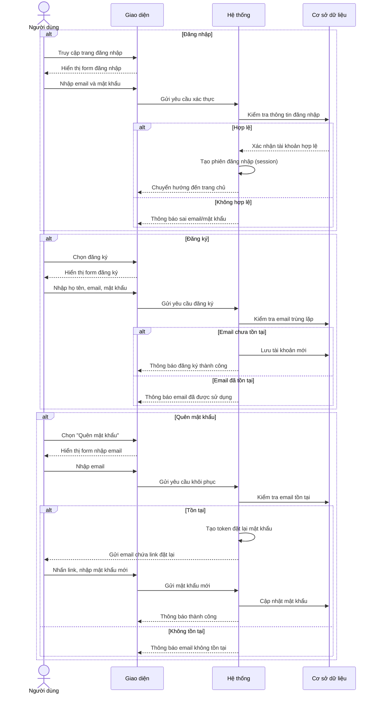
```mermaid
sequenceDiagram
    actor User as Người dùng
    participant UI as Giao diện
    participant Server as Hệ thống
    participant DB as Cơ sở dữ liệu

    alt Đăng nhập
        User->>UI: Truy cập trang đăng nhập
        UI-->>User: Hiển thị form đăng nhập
        User->>UI: Nhập email và mật khẩu
        UI->>Server: Gửi yêu cầu xác thực
        Server->>DB: Kiểm tra thông tin đăng nhập
        alt Hợp lệ
            DB-->>Server: Xác nhận tài khoản hợp lệ
            Server->>Server: Tạo phiên đăng nhập (session)
            Server-->>UI: Chuyển hướng đến trang chủ
        else Không hợp lệ
            Server-->>UI: Thông báo sai email/mật khẩu
        end
    end

    alt Đăng ký
        User->>UI: Chọn đăng ký
        UI-->>User: Hiển thị form đăng ký
        User->>UI: Nhập họ tên, email, mật khẩu
        UI->>Server: Gửi yêu cầu đăng ký
        Server->>DB: Kiểm tra email trùng lặp
        alt Email chưa tồn tại
            Server->>DB: Lưu tài khoản mới
            Server-->>UI: Thông báo đăng ký thành công
        else Email đã tồn tại
            Server-->>UI: Thông báo email đã được sử dụng
        end
    end

    alt Quên mật khẩu
        User->>UI: Chọn "Quên mật khẩu"
        UI-->>User: Hiển thị form nhập email
        User->>UI: Nhập email
        UI->>Server: Gửi yêu cầu khôi phục
        Server->>DB: Kiểm tra email tồn tại
        alt Tồn tại
            Server->>Server: Tạo token đặt lại mật khẩu
            Server-->>User: Gửi email chứa link đặt lại
            User->>UI: Nhấn link, nhập mật khẩu mới
            UI->>Server: Gửi mật khẩu mới
            Server->>DB: Cập nhật mật khẩu
            Server-->>UI: Thông báo thành công
        else Không tồn tại
            Server-->>UI: Thông báo email không tồn tại
        end
    end
```

## 2.9.5. Thiết kế giao diện Đăng nhập, Đăng ký

Giao diện đăng nhập gồm form nhập email và mật khẩu, nút đăng nhập, link "Quên mật khẩu" và link "Đăng ký". Giao diện đăng ký gồm form nhập họ tên, email, mật khẩu, xác nhận mật khẩu và nút đăng ký. Giao diện quên mật khẩu gồm form nhập email và nút gửi yêu cầu. Thiết kế đơn giản, trực quan, đảm bảo trải nghiệm người dùng tốt.

*Hình 2.11. Giao diện Đăng nhập, Đăng ký*

---

# 2.10. Module Kiểm kê kho (Inventory Checks)

## 2.10.1. Giới thiệu chức năng

Chức năng kiểm kê kho hỗ trợ thủ kho định kỳ đối chiếu số lượng thực tế trong kho với số liệu lưu trữ trên hệ thống. Phiếu kiểm kê giúp phát hiện sự chênh lệch (dôi dư hoặc hao hụt) để từ đó tự động điều chỉnh lại số dư tồn kho cho chuẩn xác sau khi được Admin phê duyệt. Phạm vi công việc bao gồm tạo phiếu kiểm kê, nhập số liệu thực tế, tính chênh lệch, trình duyệt và cập nhật tồn kho sau phê duyệt.

## 2.10.2. Tác nhân và biểu đồ ca sử dụng

- **Quản trị viên:** Phê duyệt hoặc từ chối phiếu kiểm kê, xem lịch sử kiểm kê toàn hệ thống.
- **Nhân viên kho:** Tạo phiếu kiểm kê, nhập số lượng thực tế, xem kết quả chênh lệch và theo dõi trạng thái phiếu.

### Biểu đồ Use Case - Kiểm kê kho

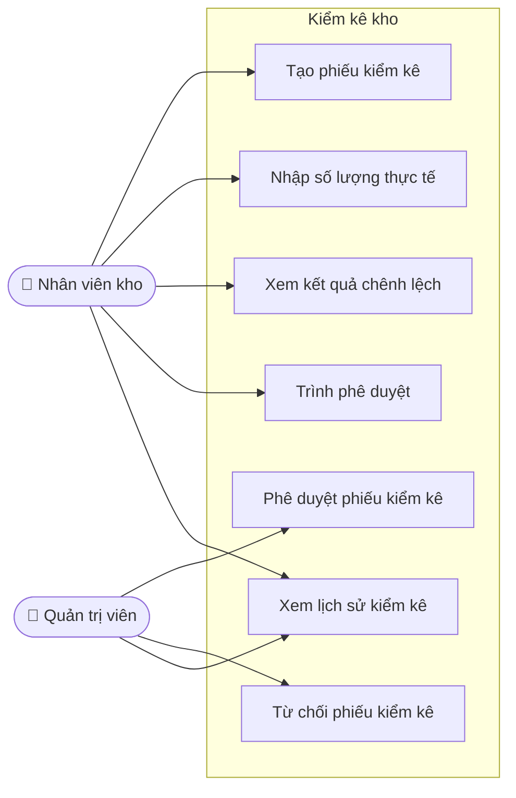
```mermaid
flowchart LR
    Admin(["👑 Quản trị viên"])
    NVKho(["👷 Nhân viên kho"])

    subgraph UC_KiemKe [Kiểm kê kho]
        UC1["Tạo phiếu kiểm kê"]
        UC2["Nhập số lượng thực tế"]
        UC3["Xem kết quả chênh lệch"]
        UC4["Trình phê duyệt"]
        UC5["Phê duyệt phiếu kiểm kê"]
        UC6["Từ chối phiếu kiểm kê"]
        UC7["Xem lịch sử kiểm kê"]
    end

    Admin --> UC5
    Admin --> UC6
    Admin --> UC7

    NVKho --> UC1
    NVKho --> UC2
    NVKho --> UC3
    NVKho --> UC4
    NVKho --> UC7
```

## 2.10.3. Quy trình kiểm kê kho

### a) Tạo và nhập phiếu kiểm kê

| Mục | Nội dung |
|-----|----------|
| **Mục đích** | Ghi nhận kết quả kiểm đếm thực tế để đối chiếu với số liệu hệ thống |
| **Các bước thực hiện** | 1. Nhân viên kho chọn tính năng tạo phiếu kiểm kê. 2. Chọn kho cần kiểm kê, nhập ngày kiểm kê. 3. Hệ thống tự động load danh sách vật tư trong kho kèm `system_quantity`. 4. Nhân viên nhập `actual_quantity` cho từng vật tư. 5. Hệ thống tính `difference = actual - system` tự động. 6. Nhân viên lưu và trình phê duyệt (trạng thái: **pending**). |
| **Tham chiếu** | Form tạo phiếu kiểm kê |

### b) Phê duyệt phiếu kiểm kê

| Mục | Nội dung |
|-----|----------|
| **Mục đích** | Xác nhận kết quả kiểm kê và cập nhật lại tồn kho thực tế |
| **Các bước thực hiện** | 1. Quản trị viên xem danh sách phiếu kiểm kê chờ duyệt. 2. Xem chi tiết chênh lệch từng vật tư. 3. Nếu **phê duyệt**: Hệ thống cập nhật tồn kho theo `actual_quantity`, trạng thái → **approved**. 4. Nếu **từ chối**: Nhập lý do, trạng thái → **cancelled**, thủ kho kiểm tra lại. |
| **Tham chiếu** | Danh sách phiếu kiểm kê chờ duyệt |

## 2.10.4. Thiết kế cơ sở dữ liệu

### Bảng `inventory_checks` (Phiếu kiểm kê)

| STT | Diễn giải | Tên trường | Kiểu dữ liệu | Ràng buộc | Ghi chú |
|-----|-----------|------------|--------------|-----------|---------|
| 1 | Mã phiếu | id | bigint | PK | Auto increment |
| 2 | Kho kiểm kê | warehouse_id | bigint | FK, Not Null | Tham chiếu bảng warehouses |
| 3 | Người lập | created_by | bigint | FK, Not Null | Tham chiếu bảng users |
| 4 | Ngày kiểm kê | check_date | date | Not Null | |
| 5 | Ghi chú | notes | text | Null | |
| 6 | Trạng thái | status | enum | Not Null | pending / approved / cancelled |
| 7 | Người duyệt | approved_by | bigint | FK, Null | Tham chiếu bảng users |
| 8 | Ngày duyệt | approved_at | timestamp | Null | |
| 9 | Thời gian tạo | created_at | timestamp | Not Null | |
| 10 | Thời gian cập nhật | updated_at | timestamp | Not Null | |

### Bảng `inventory_check_details` (Chi tiết kiểm kê)

| STT | Diễn giải | Tên trường | Kiểu dữ liệu | Ràng buộc | Ghi chú |
|-----|-----------|------------|--------------|-----------|---------|
| 1 | Mã chi tiết | id | bigint | PK | Auto increment |
| 2 | Mã phiếu | inventory_check_id | bigint | FK, Not Null | Tham chiếu bảng inventory_checks |
| 3 | Mã vật tư | material_id | bigint | FK, Not Null | Tham chiếu bảng materials |
| 4 | Tồn hệ thống | system_quantity | int | Not Null | Số lượng trên phần mềm tại thời điểm kiểm kê |
| 5 | Tồn thực tế | actual_quantity | int | Not Null | Số lượng thủ kho đếm được |
| 6 | Chênh lệch | difference | int | Not Null | = actual_quantity - system_quantity |
| 7 | Ghi chú | notes | text | Null | Ghi chú cho từng dòng vật tư |

## 2.10.5. Thiết kế quy trình nghiệp vụ

```mermaid
sequenceDiagram
    actor NV as Nhân viên kho
    actor Admin as Quản trị viên
    participant UI as Giao diện
    participant Server as Hệ thống
    participant DB as Cơ sở dữ liệu

    NV->>UI: Tạo phiếu kiểm kê
    UI-->>NV: Hiển thị form chọn kho
    NV->>UI: Chọn kho, nhập ngày kiểm kê
    UI->>Server: Yêu cầu danh sách vật tư trong kho
    Server->>DB: Truy vấn tồn kho hiện tại
    DB-->>Server: Trả về danh sách + system_quantity
    Server-->>UI: Hiển thị form nhập actual_quantity
    NV->>UI: Nhập số lượng thực tế từng vật tư
    UI->>Server: Tính difference và lưu phiếu
    Server->>DB: Lưu phiếu (status: pending)
    DB-->>Server: Xác nhận lưu
    Server-->>UI: Thông báo tạo phiếu thành công

    Admin->>UI: Xem danh sách phiếu chờ duyệt
    UI->>Server: Yêu cầu phiếu pending
    Server->>DB: Truy vấn phiếu chờ duyệt
    DB-->>Server: Trả về danh sách
    Server-->>UI: Hiển thị danh sách phiếu

    Admin->>UI: Chọn phiếu và phê duyệt
    alt Phê duyệt
        UI->>Server: Gửi yêu cầu duyệt
        Server->>DB: Cập nhật tồn kho theo actual_quantity
        Server->>DB: Cập nhật status = approved
        DB-->>Server: Xác nhận
        Server-->>UI: Thông báo phê duyệt thành công
    else Từ chối
        UI->>Server: Gửi lý do từ chối
        Server->>DB: Cập nhật status = cancelled
        Server-->>UI: Thông báo từ chối
    end
```

## 2.10.6. Thiết kế giao diện quản lý Kiểm kê kho

Giao diện kiểm kê kho gồm: danh sách phiếu kiểm kê dạng bảng với các cột mã phiếu, kho, ngày kiểm kê, người lập, trạng thái (thẻ màu: Chờ duyệt / Đã duyệt / Đã hủy). Form tạo phiếu hiển thị bảng vật tư với cột tồn hệ thống và ô nhập tồn thực tế, tự động tính chênh lệch. Màu đỏ cho chênh lệch âm (hao hụt), màu xanh cho chênh lệch dương (dôi dư).

*Hình 2.12. Giao diện quản lý Kiểm kê kho*

---

# 2.11. Module Cảnh báo tồn kho (Inventory Alerts)

## 2.11.1. Giới thiệu chức năng

Chức năng cảnh báo tồn kho tự động giúp đảm bảo kho không bao giờ bị đứt gãy vật tư. Khi số lượng thực tế của một vật tư giảm xuống dưới `min_stock_level` đã thiết lập, hệ thống tự động sinh ra một cảnh báo để người quản lý kịp thời lên kế hoạch nhập bổ sung.

## 2.11.2. Tác nhân và biểu đồ ca sử dụng

- **Quản trị viên:** Xem toàn bộ danh sách cảnh báo, xử lý cảnh báo, thiết lập mức tồn kho tối thiểu cho vật tư.
- **Nhân viên kho:** Xem danh sách cảnh báo thuộc kho phụ trách, đánh dấu đã xử lý.

### Biểu đồ Use Case - Cảnh báo tồn kho

```mermaid
flowchart LR
    System(["⚙️ Hệ thống\n(tự động)"])
    Admin(["👑 Quản trị viên"])
    NVKho(["👷 Nhân viên kho"])

    subgraph UC_Alert [Cảnh báo tồn kho]
        UC1["Tự động tạo cảnh báo\nkhi tồn < min_stock"]
        UC2["Xem danh sách cảnh báo"]
        UC3["Xử lý cảnh báo\n(đánh dấu đã xử lý)"]
        UC4["Thiết lập mức\ntồn kho tối thiểu"]
        UC5["Lọc cảnh báo\ntheo kho / vật tư"]
    end

    System --> UC1

    Admin --> UC2
    Admin --> UC3
    Admin --> UC4
    Admin --> UC5

    NVKho --> UC2
    NVKho --> UC3
    NVKho --> UC5
```

## 2.11.3. Quy trình Cảnh báo tồn kho

### a) Tự động tạo cảnh báo

| Mục | Nội dung |
|-----|----------|
| **Mục đích** | Phát hiện kịp thời vật tư sắp hết để lên kế hoạch nhập bổ sung |
| **Các bước thực hiện** | 1. Sau mỗi giao dịch xuất kho hoặc sau khi phê duyệt phiếu kiểm kê, hệ thống kiểm tra tồn kho. 2. Nếu `current_stock < min_stock_level`: Hệ thống tự động tạo bản ghi cảnh báo. 3. Cảnh báo hiển thị trên dashboard và danh sách cảnh báo. 4. Trạng thái mặc định: **unresolved** (Cần nhập hàng). |
| **Tham chiếu** | Bảng inventory_alerts |

### b) Xử lý cảnh báo

| Mục | Nội dung |
|-----|----------|
| **Mục đích** | Đánh dấu vật tư đã được lên kế hoạch nhập bổ sung |
| **Các bước thực hiện** | 1. Quản trị viên/Nhân viên xem danh sách cảnh báo. 2. Chọn cảnh báo cần xử lý, nhấn nút **"Xử lý"**. 3. Xác nhận trong hộp thoại xác nhận. 4. Hệ thống cập nhật trạng thái → **resolved** (Đã xử lý). 5. Ghi nhận thời gian và người xử lý. |
| **Tham chiếu** | Danh sách cảnh báo tồn kho |

## 2.11.4. Thiết kế cơ sở dữ liệu

### Bảng `inventory_alerts` (Cảnh báo tồn kho)

| STT | Diễn giải | Tên trường | Kiểu dữ liệu | Ràng buộc | Ghi chú |
|-----|-----------|------------|--------------|-----------|---------|
| 1 | Mã cảnh báo | id | bigint | PK | Auto increment |
| 2 | Mã vật tư | material_id | bigint | FK, Not Null | Tham chiếu bảng materials |
| 3 | Mã kho | warehouse_id | bigint | FK, Not Null | Tham chiếu bảng warehouses |
| 4 | Tồn thực tế | current_stock | int | Not Null | Số lượng tại thời điểm cảnh báo |
| 5 | Tồn tối thiểu | min_stock_level | int | Not Null | Ngưỡng cảnh báo của vật tư |
| 6 | Trạng thái | status | enum | Not Null | unresolved / resolved |
| 7 | Ngày cảnh báo | alerted_at | timestamp | Not Null | Thời điểm hệ thống tạo cảnh báo |
| 8 | Người xử lý | resolved_by | bigint | FK, Null | Tham chiếu bảng users |
| 9 | Ngày xử lý | resolved_at | timestamp | Null | Thời điểm đánh dấu đã xử lý |

## 2.11.5. Thiết kế quy trình nghiệp vụ

```mermaid
sequenceDiagram
    participant System as ⚙️ Hệ thống (tự động)
    actor Admin as Quản trị viên / Nhân viên
    participant UI as Giao diện
    participant DB as Cơ sở dữ liệu

    Note over System,DB: Trigger sau mỗi giao dịch xuất kho
    System->>DB: Truy vấn tồn kho sau giao dịch
    DB-->>System: Trả về current_stock
    System->>System: So sánh current_stock vs min_stock_level

    alt current_stock < min_stock_level
        System->>DB: Tạo bản ghi inventory_alerts (status: unresolved)
        DB-->>System: Xác nhận lưu
        System-->>UI: Hiển thị badge cảnh báo trên dashboard
    end

    Admin->>UI: Xem danh sách cảnh báo
    UI->>DB: Truy vấn alerts (status: unresolved)
    DB-->>UI: Trả về danh sách vật tư cần nhập

    Admin->>UI: Nhấn "Xử lý" cho cảnh báo
    UI-->>Admin: Hiển thị hộp thoại xác nhận
    Admin->>UI: Xác nhận xử lý
    UI->>DB: Cập nhật status = resolved, resolved_by, resolved_at
    DB-->>UI: Xác nhận cập nhật
    UI-->>Admin: Cập nhật giao diện (thẻ màu: Đã xử lý)
```

## 2.11.6. Thiết kế giao diện Cảnh báo tồn kho

Giao diện quản lý cảnh báo hiển thị bảng danh sách các vật tư có số lượng dưới mức an toàn với các cột: mã vật tư, tên vật tư, kho, tồn tối thiểu, tồn thực tế, trạng thái xử lý (thẻ màu: 🔴 Cần nhập hàng / 🟢 Đã xử lý) và ngày cảnh báo.

Tại cột hành động, người quản lý có thể nhấn nút **"Xử lý"** kèm theo hộp thoại xác nhận để đánh dấu vật tư đó đã được lên kế hoạch nhập bổ sung, từ đó đảm bảo quy trình vận hành kho không bị gián đoạn. Dashboard tổng quan hiển thị số lượng cảnh báo chưa xử lý nổi bật để người quản lý dễ theo dõi.

*Hình 2.13. Giao diện Cảnh báo tồn kho*
